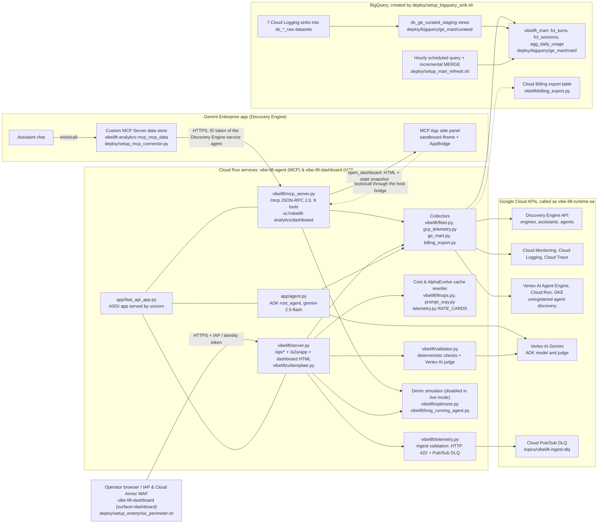
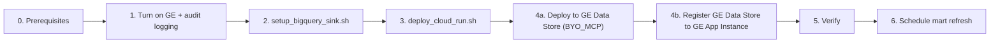

# VibeLift — Gemini Enterprise Agent Fleet Observability & Prompt-Cache FinOps

[](https://github.com/enriquekalven/vibe_lift_agent/actions/workflows/tests.yml)

**VibeLift** is an observability and prompt-cache FinOps tool for Gemini Enterprise agent fleets. It is built on Google Cloud with the **Google Agent Development Kit (ADK)**, **FastAPI** and the **Model Context Protocol (MCP)**.

It runs as a private **Cloud Run** service and opens inside **Gemini Enterprise** as an MCP App. VibeLift lists the agents registered in your global and regional Gemini Enterprise apps, joins that inventory with Cloud Monitoring metrics, OpenTelemetry `gen_ai` logs and Cloud Trace, and estimates token cost and prompt-cache savings from measured token counts and list prices. It also ships a clearly labeled **optimizer simulator** (`alpha_evolve`, `opus_critic` and `hybrid_ensemble` modes). The simulator applies fixed improvement factors to demo profiles; it calls no optimizer or model and changes no agent.

> [!IMPORTANT]
> **What is live, what is simulated, and what is not built yet:** see [docs/ARCHITECTURE.md](docs/ARCHITECTURE.md) (diagram legend and known gaps) and [Security controls and known gaps](#security-controls-and-known-gaps) below.

> **Deploying to your own project?**
> - **No AI tools or no local CLI installed?** Follow the **[Manual Deployment Contingency Guide (Browser-Only, Zero Local Setup)](#manual-deployment-contingency-guide-browser-only-zero-local-setup)**.
> - **Standard CLI deployment:** Follow **[Deploy in Your Own GCP Project](#deploy-in-your-own-gcp-project)** for prerequisites, logging, BigQuery, Cloud Run, Gemini Enterprise registration, verification, and [troubleshooting](#troubleshooting).

---

## Architecture Overview

Every box names the file or Google Cloud resource behind it. The legend in [docs/ARCHITECTURE.md](docs/ARCHITECTURE.md) says which parts read live data, which part is a simulator, and what is not configured.

<!-- BEGIN ARCHITECTURE DIAGRAM: copied from docs/ARCHITECTURE.md; tests/test_docs_integrity.py checks that both copies match -->

<!-- END ARCHITECTURE DIAGRAM -->

---

## Core Capabilities

The dashboard has 4 basic tabs (**Overview**, **Agents**, **Cost**, **Users**) and 3 advanced tabs (**Goals & Metrics**, **Optimizer & Testing**, **SDK & Tools**). When it is connected to a real project, panels that run on example inputs are hidden.

### 1. Live Gemini Enterprise agent fleet (Agents tab)
- **Multi-region Discovery Engine inventory**: lists every agent in the configured Gemini Enterprise apps (`VIBELIFT_GE_ENGINES`; `auto` scans `global`, `us` and `eu`) across all assistants and pages. With `VIBELIFT_DISCOVER_UNREGISTERED`, it also finds standalone Agent Engine, Cloud Run and GKE workloads.
- **Joined Cloud telemetry**:
  - **ADK agents on Vertex AI Agent Engine**: Cloud Monitoring `reasoning_engine` metrics (request volume, 4xx/5xx error rates, p50/p95 latency, vCPU and memory allocation) joined with per-agent OpenTelemetry `gen_ai` log events (LLM calls, input/output/cached tokens, active conversations, last activity). Prompt message bodies are never read into the payload.
  - **A2A agents on Cloud Run**: service-level `run.googleapis.com` request, error, latency and container allocation metrics.
  - **Low-code, workflow and Google-managed agents**: classifies Agent Designer (`lowCodeAgentDefinition`, `workflowAgentDefinition`), Dialogflow and Google-managed agents (`Deep Research`).
- **Project-wide model usage**: Vertex AI publisher token and invocation metrics (`publisher/online_serving/*`) next to Gemini Enterprise `StreamAssist` traffic. Models without a rate card stay unpriced instead of getting a guessed price.
- **No synthetic fallbacks in the collectors**: an unavailable source returns `null` metrics and is listed in `source_status` and `errors`. Fleet snapshots are cached in memory (`VIBELIFT_FLEET_TTL_SECONDS=60`) with rate-limited forced refreshes (`VIBELIFT_FLEET_MIN_REFRESH_SECONDS=10`).
- **Trace logging switch**: turns Discovery Engine trace logging (`observabilityConfig`) on or off for one agent or for all agents. This changes live agent settings, so the MCP tool asks the user to confirm.

### 2. Cost and Users tabs
- **Token cost estimates**: measured token counts multiplied by the list prices in `RATE_CARDS` ([vibelift/telemetry.py](vibelift/telemetry.py)) for `gemini-2.5-flash`, `gemini-2.5-pro`, `gemini-3.5-flash`, `gemini-3.6-flash`, `gemini-3.7-flash`, `gemini-3.8-flash`, `gemini-3.1-flash`, `gemini-3.1-flash-lite`, `gemini-3.5-pro`, `gemini-1.5-flash`, `gemini-1.5-pro`, `claude-opus-5-5` and `claude-opus-4-6`. Cards that were checked against the Vertex AI pricing page say so in a code comment. These are estimates, not billed cost.
- **Billed cost**: read from the Cloud Billing BigQuery export when `VIBELIFT_BILLING_EXPORT_TABLE` is set. When it is not set, or the query fails, the Cost tab shows the status and a fix hint (`invalid_table_name`, `permission_denied`, `schema_mismatch`, `not_found`, `bytes_limit`, `auth`, `timeout`) instead of a number.
- **Per-user and per-session tokens** (Users tab): rollups from `vibelift_mart.fct_sessions` / `fct_turns`, with a list-price estimate per user. Token counts only, no prompt text.
- **Plain-English search** (advanced, `/api/nl2sql`): the question picks one of 5 fixed `SELECT` templates over `vibelift_mart`; its text never enters the SQL. On a real project the query is checked (one read-only statement over the mart) and run on BigQuery with a 100 MB `maximumBytesBilled` cap, and the drawer shows BigQuery's rows or its error. In demo mode the rows are labeled simulator output.
- **What-if from observed usage** (`/api/what_if_live`): projects a model switch or a different cache share from the project's measured usage. The parametric what-if and Tokenomics cockpit panels use example inputs, so they are off on a real project.

### 3. Prompt Cache X-Ray, AlphaEvolve Optimization & Telemetry Validator
- **Prompt Cache X-Ray & AlphaEvolve Rewriter** (`xray_prompt_cache`, `/api/prompt_xray`): compares two prompt snapshots character by character, reports the line and column where dynamic content (timestamps, IDs, unsorted JSON) breaks the cached prefix, and proposes a cache-friendly rewrite. The rewriter (`propose_cache_friendly_rewrite` in [vibelift/prompt_xray.py](vibelift/prompt_xray.py)) was evolved via the **AlphaEvolve** harness in [experiments/prompt_cache_evolve/](experiments/prompt_cache_evolve/), lifting `composite_cache_savings_score` from `0.7321` to `0.9957` across 12 multi-turn enterprise prompt benchmarks (canonicalizing multi-line JSON objects, fenced ```` ```json ```` blocks, and mixed static/volatile JSON keys). Live mode compares logged turns from the prompt-log bucket (`VIBELIFT_PROMPT_XRAY_LIVE=1`).
- **Telemetry validator** (`/api/validate_telemetry`): deterministic grounding checks on the dashboard numbers, plus an optional Vertex AI Gemini judge ([vibelift/validator.py](vibelift/validator.py), `VIBELIFT_JUDGE_MODEL`, default `gemini-2.5-flash`).

### 4. Instrumentation, Validated Ingest & Cloud Pub/Sub Dead-Letter Queue (SDK & Tools tab)
- **`@vibelift_telemetry` decorator**: wraps a sync or async agent handler, measures wall-clock latency, and reads token counts from the handler's return value (a Gemini response's `usage_metadata`, or `prompt_tokens` / `cached_tokens` / `output_tokens` keys). Values the handler does not report stay empty; nothing is filled in.
- **Validated HTTP ingest & Pub/Sub DLQ**: `POST /api/decorator_ingest`, `/api/aive_log` and `/api/csat_rating` check every field. An invalid body gets HTTP 422, is stored as a values-free dead-letter record (`GET /api/dead_letters`: key names, size and SHA-256 only), and is published to the Cloud Pub/Sub Dead-Letter Queue topic (`projects/PROJECT_ID/topics/vibelift-ingest-dlq` when `VIBELIFT_DLQ_PUBSUB_TOPIC` is set).

### 5. Demo Simulator (Disabled in Live Mode; Preserved on `feature/what-if-simulator`)
- On a real Google Cloud project (`live_data: true`), all simulator buttons and tabs (`sim-panel`) are hidden in the UI and simulator endpoints (`/api/inject_anomaly`, `/api/step_turn`, `/api/evolve_generation`, `/api/what_if_simulate`, `/api/recompute_finops`) return `DISABLED_IN_LIVE_MODE` (unless `VIBELIFT_ENABLE_SIMULATOR=1`). The full interactive simulator is preserved on the `feature/what-if-simulator` branch and in offline demo mode.

### 6. Native Gemini Enterprise MCP App (`ui://vibelift-analytics/dashboard`)
- **Streamable HTTP MCP server**: MCP `2025-06-18` and `2025-03-26` at `/mcp`, with 9 tools.
- **Side panel and fullscreen**: opens in the Gemini Enterprise right side panel (`pip`) by default, with a Fullscreen toggle through the MCP AppBridge (`ui/request-display-mode`).
- **Embedded live state**: every `open_dashboard` call and `resources/read` response embeds a fresh server-side snapshot of `state`, `gcp_telemetry` and `ge_fleet` in the HTML, so the dashboard renders inside the sandboxed iframe without cross-origin calls.

---

## Repository Structure

```text
vibe_lift_agent/
├── app/                         # ADK entry points (agents-cli agent_directory)
│   ├── agent.py                 # ADK root_agent and tools
│   └── fast_api_app.py          # Production ASGI app (Cloud Run CMD)
├── vibelift/                    # Application package
│   ├── server.py                # REST routes, A2A JSON-RPC (/a2a/app) + standalone HTTP server
│   ├── mcp_server.py            # MCP JSON-RPC 2.0 server and MCP App bridge
│   ├── fleet.py                 # Gemini Enterprise inventory joined with Monitoring, Logging and Trace
│   ├── finops.py                # Live token economics, spend drift, what-if projections
│   ├── billing_export.py        # Cloud Billing export (BigQuery) reader
│   ├── gcp_telemetry.py         # Cloud Run, Logging and BigQuery collectors
│   ├── ge_mart.py               # BigQuery vibelift_mart SQL builders, incremental MERGE & PII masking
│   ├── prompt_xray.py           # Character-level Prompt Cache X-Ray & AlphaEvolve cache-friendly rewriter
│   ├── sme_eval.py              # 6-Persona x 5-Dimension (30-check) SME evaluation engine
│   ├── telemetry.py             # Rate cards, cache economics, Pub/Sub DLQ, @vibelift_telemetry
│   ├── validator.py             # Deterministic checks + LLM-as-judge audit
│   ├── optimizer.py             # Demo simulator (disabled in live mode) and user analytics
│   ├── long_running_agent.py    # Multi-turn trajectory simulator
│   └── ui/
│       ├── template.py          # Dashboard HTML/JS
│       ├── logo_asset.py        # Embedded brand assets
│       └── static/              # Source logo images
├── experiments/
│   └── prompt_cache_evolve/     # AlphaEvolve experiment evolving propose_cache_friendly_rewrite
│       ├── initial_program.py   # EVOLVE-BLOCK candidate + 12-pair enterprise prompt benchmark
│       ├── evaluator.py         # CLI-compatible AlphaEvolve evaluator
│       ├── test_program.py      # Candidate unit tests
│       └── test_evaluator.py    # Evaluator unit tests
├── tests/                       # Offline test suite (no live API calls; see docs/TESTING.md)
├── deploy/
│   ├── deploy_cloud_run.sh      # Tests, then idempotent Cloud Run + IAM deploy
│   ├── setup_enterprise_perimeter.sh # Cloud Armor WAF, Serverless NEG, Pub/Sub DLQ, BQ masking & VPC-SC
│   ├── cloudbuild.yaml          # Build -> test -> push -> deploy
│   ├── cloud_run_service.yaml   # Declarative service reference
│   ├── setup_bigquery_sink.sh   # BigQuery datasets, Logging sinks, analytics tables, curated views + mart
│   ├── set_log_retention.sh     # Raw log retention (partition expiration, default 90 days)
│   ├── fix_customer_sinks_and_retention.sh # Audits & remediates customer sinks, retention, and mart views
│   ├── setup_mart_refresh.sh    # Hourly BigQuery scheduled query that rebuilds fct_turns
│   ├── register_ge_agent.sh     # Deploys Custom MCP Data Store (BYO_MCP) & registers it to a GE App instance (A2A opt-in)
│   ├── setup_mcp_connector.py   # Deploys Custom MCP Data Store (NOT Agent Registry) & links dataStoreIds to GE App instance
│   └── bigquery/
│       ├── provision_ge_mart.py # Curated views + vibelift_mart (apply / refresh / scheduled-query DDL)
│       ├── verify_ge_mart_invariants.py # 13 conservation & reconciliation invariants across raw/curated/mart
│       └── ge_mart/             # SQL templates for the curated and mart layers
├── docs/
│   ├── ARCHITECTURE.md          # Diagram as code, legend (live / simulated / not configured), known gaps
│   ├── PERMISSIONS.md           # Every IAM role, API and org policy VibeLift needs
│   ├── spec.md                  # Architecture and data-source specification
│   ├── GE_MART.md               # Gemini Enterprise curated views and reporting mart
│   ├── LOOKER_STUDIO_GUIDE.md   # 4-page Looker Studio L1/L2 IT Support Dashboard guide
│   ├── SME_EVALUATION_REPORT.md # 6-Persona x 5-Dimension (30-check) SME evaluation report
│   ├── TESTING.md               # Requirement -> test map, CI gates
│   ├── SKILL.md                 # Agent skill reference
│   └── mcp_spec.json            # MCP tool catalog
├── .github/workflows/tests.yml  # CI: full test suite on push and PR
├── Dockerfile
├── pyproject.toml, requirements.txt, constraints.txt
└── agents-cli-manifest.yaml
```

---

## Configuration & Environment Variables

Runtime variables are read by the service (set on Cloud Run by `deploy/deploy_cloud_run.sh`, or in `.env` locally; copy [.env.example](.env.example)). Unset variables use the defaults below.

**Core**

| Variable | Default | Description |
| :--- | :--- | :--- |
| `GOOGLE_CLOUD_PROJECT` | Metadata server / active `gcloud` project | Target GCP Project ID (supports both standard and domain-scoped `domain:project-id`). Falls back to `UNCONFIGURED-PROJECT` if unset so it never queries an unintended project. |
| `GOOGLE_CLOUD_REGION` | `us-central1` | Primary region for Cloud Run and Vertex AI. |
| `GOOGLE_GENAI_USE_VERTEXAI` | `TRUE` (when no API key is set) | Routes ADK `root_agent` model calls through Vertex AI using the runtime service account. |
| `GOOGLE_CLOUD_LOCATION` | `GOOGLE_CLOUD_REGION` | Vertex AI location for ADK model calls. |
| `VIBELIFT_PUBLIC_URL` | `https://SERVICE-PROJECT_NUMBER.REGION.run.app` | Canonical public URL published in the A2A agent card and MCP metadata. |
| `PUBLIC_A2A_URL` | `${VIBELIFT_PUBLIC_URL}/a2a/app` | Override for the `url` field in the A2A agent card (`POST /a2a/app` executes live JSON-RPC tasks). |
| `VIBELIFT_SURFACE` | `all` | Active service surface (`all`, `mcp`, or `dashboard`) for edge-split deployments (`VIBELIFT_SPLIT_EDGE=1`). |
| `VIBELIFT_ENABLE_SIMULATOR` | `0` | Keep `0` in production so simulator endpoints return `DISABLED_IN_LIVE_MODE` when connected to a real GCP project. |
| `PORT` / `HOST` | `8080` / `0.0.0.0` | Listen address. |
| `USE_UVICORN` | `0` (deploy sets `1`) | Serve the FastAPI app with uvicorn instead of the stdlib server. |
| `ALLOWED_ORIGINS` | `*` | Comma-separated CORS origin allowlist. |
| `ENABLE_MCP_APP` | `1` | Enables (`1`) or disables (`0`) the `/mcp` JSON-RPC 2.0 server. |
| `MCP_PROTOCOL_VERSION` | `2025-06-18` | Version offered when a client requests one the server doesn't support (`2025-06-18`, `2025-11-25`, `2025-03-26` or `2024-11-05`). |

**Gemini Enterprise fleet and runtimes**

| Variable | Default | Description |
| :--- | :--- | :--- |
| `VIBELIFT_GE_ENGINES` | `auto` | `auto` discovers every Gemini Enterprise app in `VIBELIFT_GE_LOCATIONS`. Or a comma-separated list of `location/engine_id` (for example `global/my-app,us/my-us-app`); a bare ID uses `VIBELIFT_GE_LOCATION`. If `auto` finds no apps, the dashboard shows an error instead of guessing. |
| `VIBELIFT_GE_LOCATIONS` | `global,us,eu` | Discovery Engine locations scanned by `auto`. |
| `VIBELIFT_GE_LOCATION` | `global` | Default location for engine IDs given without a `location/` prefix. |
| `VIBELIFT_GE_COLLECTION` | `default_collection` | Discovery Engine collection ID. |
| `VIBELIFT_DISCOVER_UNREGISTERED` | `true` (in a real project) | Also discover standalone Agent Engine, Cloud Run and GKE workloads that are not registered in Gemini Enterprise. |
| `VIBELIFT_RE_LOCATIONS` | `us-central1,us-west1,us-east4,europe-west1` | Regions scanned for standalone Vertex AI Agent Engine (Reasoning Engine) instances. |
| `VIBELIFT_MONITORED_SERVICES` | *(empty)* | Optional comma-separated Cloud Run services to include in `/api/gcp_telemetry`. |
| `VIBELIFT_FLEET_TTL_SECONDS` | `60` | In-memory cache TTL (seconds) per telemetry time window. |
| `VIBELIFT_FLEET_MIN_REFRESH_SECONDS` | `10` | Minimum cooldown interval (seconds) between forced fleet refreshes. |
| `VIBELIFT_FLEET_WINDOW_HOURS` | `24` | Default telemetry aggregation window in hours. |
| `VIBELIFT_TOKEN_LOG_MAX_ENTRIES` | `3000` | Maximum OpenTelemetry `gen_ai` log entries scanned per fleet collection. |
| `VIBELIFT_TRACE_MAX_PAGES` | `6` | Maximum Cloud Trace pages read per collection. |
| `VIBELIFT_BACKGROUND_WARMER` | on in Cloud Run | Set to `1` to pre-warm caches in the background when running outside Cloud Run. |

**BigQuery, cost, PII governance and audit**

| Variable | Default | Description |
| :--- | :--- | :--- |
| `VIBELIFT_GE_CURATED_DATASET` | `ds_ge_curated_staging` | Curated views dataset (`v_user_activity_curated`, `v_agentic_operations_curated`, `v_consolidated_audit_log`, `v_model_armor_curated`; see [docs/GE_MART.md](docs/GE_MART.md)). |
| `VIBELIFT_GE_MART_DATASET` | `vibelift_mart` | Reporting mart dataset (`v_fct_turns`, `fct_turns`, `fct_sessions`, `agg_daily_usage`, `v_looker_l1_l2_support`). |
| `VIBELIFT_PII_REDACT` | `0` | `1` enables runtime SHA-256 pseudonymization of `user_email` (`user-<12hex>@domain`) across all mart readers. |
| `VIBELIFT_DLQ_PUBSUB_TOPIC` | *(empty)* | Cloud Pub/Sub Dead-Letter Queue topic (`projects/PROJECT_ID/topics/vibelift-ingest-dlq`) where rejected HTTP 422 ingest events are published. |
| `VIBELIFT_BILLING_EXPORT_TABLE` | *(empty)* | Cloud Billing BigQuery export table (`project.dataset.gcp_billing_export_v1_XXXX`). Empty = billed cost shown as unknown. |
| `VIBELIFT_BQ_MAX_BYTES_BILLED` | `10737418240` (10 GB) | Default `maximumBytesBilled` for the service's BigQuery REST queries (`0` disables it). Plain-English search always sends its own 100 MB cap. |
| `VIBELIFT_RATE_CARDS_JSON` | *(empty)* | Optional JSON that adds or overrides list-price rate cards (`input`, `output`, `cached_read`, `cache_write` per 1M tokens) for the fleet and per-user cost estimates. |
| `VIBELIFT_PROMPT_XRAY_LIVE` | *(off)* | `1` lets the Prompt Cache X-Ray read logged prompts from the prompt-log bucket. Those are raw user prompts, so it is opt-in. |
| `VIBELIFT_JUDGE_MODEL` | `gemini-2.5-flash` | Model used by the LLM-as-judge audit. |
| `VIBELIFT_JUDGE_LOCATION` | `us-central1` | Vertex AI location for the judge model. |
| `VIBELIFT_JUDGE_TIMEOUT_S` | `25` | Judge call timeout in seconds. |

**Deploy-script variables** (read by the scripts in `deploy/`, not by the service)

| Variable | Used by | Default | Description |
| :--- | :--- | :--- | :--- |
| `SERVICE_NAME` | all scripts | `vibe-lift-agent` | Cloud Run service name. |
| `VIBELIFT_SPLIT_EDGE` | `deploy_cloud_run.sh` | `0` | `1` deploys both `vibe-lift-agent` (`surface=mcp`) and `vibe-lift-dashboard` (`surface=dashboard`, `--iap`). |
| `VIBELIFT_SKIP_TESTS` | `deploy_cloud_run.sh` | `0` | `1` deploys without running the local test gate (not recommended). |
| `VIBELIFT_INVOKERS` | `deploy_cloud_run.sh` | *(empty)* | Comma-separated IAM members granted `roles/run.invoker` so they can open the dashboard, for example `user:alice@example.com,group:finops@example.com`. |
| `BQ_LOCATION` | `setup_bigquery_sink.sh`, `setup_mart_refresh.sh` | `US` | BigQuery location for all datasets. Keep it the same as your log sinks. |
| `VIBELIFT_RETENTION_DAYS` | `setup_bigquery_sink.sh`, `set_log_retention.sh` | `90` | Days of raw log history kept in BigQuery (partition expiration on the raw sink datasets). The mart reads the same window (`provision_ge_mart.py --lookback-days`, default 90). |
| `VIBELIFT_REFRESH_SCHEDULE` | `setup_mart_refresh.sh` | `every 1 hours` | How often the scheduled query rebuilds `fct_turns` (Data Transfer schedule syntax). |
| `VIBELIFT_REFRESH_SA` | `setup_mart_refresh.sh` | `vibe-lift-runtime-sa@PROJECT.iam.gserviceaccount.com` | Service account the scheduled query runs as. |
| `GE_ENGINE_ID` | `register_ge_agent.sh`, `setup_mcp_connector.py`, `deploy_cloud_run.sh` | *(required for step 4)* | Gemini Enterprise app instance ID to register the GE Data Store to (or pass it as the first argument to `register_ge_agent.sh`). |
| `GE_LOCATION` | `register_ge_agent.sh`, `setup_mcp_connector.py` | `global` | Location of that Gemini Enterprise app instance (`global`, `us`, `eu`). |
| `VIBELIFT_PUBLISH_A2A` | `register_ge_agent.sh` | `0` | `1` also publishes the A2A agent card with `agents-cli`. Off by default because the A2A endpoint is not served. |
| `VIBELIFT_PROMPT_LOG_BUCKET` | `deploy_cloud_run.sh` | *(empty)* | Prompt-log bucket for the X-Ray live mode. Setting it grants the runtime SA read access and sets `VIBELIFT_PROMPT_XRAY_LIVE=1`. |

---


## Local Development & Testing

### 1. Environment Setup
Use Python 3.12+ and install locked dependencies:

```bash
python3.12 -m venv .venv
source .venv/bin/activate
pip install -r requirements.txt -c constraints.txt
```

### 2. Run the Offline Test Suite
The test suite validates all telemetry calculations, `@vibelift_telemetry` decorator instrumentation, multi-platform optimization mutations, REST routes, MCP JSON-RPC methods, and regional/global Discovery Engine fleet joins without requiring live network calls:

```bash
GOOGLE_APPLICATION_CREDENTIALS=/nonexistent/offline.json \
GOOGLE_CLOUD_PROJECT=test-project \
python -m unittest discover -s tests -t . -v
```
See [docs/TESTING.md](docs/TESTING.md) for which test enforces which requirement.

### 3. Run the Local Server
```bash
python -m vibelift.server --port=8080
```
Open [http://localhost:8080](http://localhost:8080) to inspect the dashboard locally (`make playground` does the same). Locally the server uses your `gcloud auth application-default login` credentials against `GOOGLE_CLOUD_PROJECT`.

---

## Instrumenting Functions with `@vibelift_telemetry`

Decorate a synchronous or asynchronous agent handler, skill or tool. Each call is recorded as an in-process telemetry event; when the handler runs inside the VibeLift process, the event appears in the **SDK & Tools** tab. `tests/test_docs_integrity.py` runs this example.

```python
from vibelift.telemetry import vibelift_telemetry

@vibelift_telemetry(
    agent_name="adk_service_desk",
    model="gemini-2.5-flash",          # optional; defaults to the response's model_version
    protocol="ADK",                    # optional label
    skill_or_mcp="query_ge_agent_fleet",
    user_cohort="enterprise-it-support",
)
def handle_support_request(query: str) -> dict:
    # Token counts are read from the return value when the handler reports them:
    # a Gemini response's usage_metadata, or these dict keys.
    return {
        "status": "resolved",
        "prompt_tokens": 8200,
        "cached_tokens": 6800,
        "output_tokens": 420,
    }
```

Services in other processes can send the same event over HTTP with `POST /api/decorator_ingest`. The body is validated: a malformed body gets HTTP 422 and a values-free dead-letter record instead of being stored.

---

## Deploy in Your Own GCP Project

This section takes a fresh Google Cloud project to a working, private VibeLift deployment deployed to a **Gemini Enterprise Data Store** and registered to your **Gemini Enterprise App instance**.

> [!TIP]
> **Non-technical operator or no AI coding tools (no Claude, Antigravity, local Python, or local `gcloud`)?**
> Start directly with the **[Manual Deployment Contingency Guide (Browser-Only, Zero Local Setup)](#manual-deployment-contingency-guide-browser-only-zero-local-setup)** below. You only need a web browser and access to the Google Cloud Console.

---

### Manual Deployment Contingency Guide (Browser-Only, Zero Local Setup)

Use this contingency guide if you **do not** have Claude, Antigravity, `git`, Python, or the Google Cloud CLI installed on your computer. Everything runs inside your web browser using **Google Cloud Shell** (a pre-configured terminal built into the Google Cloud Console) and the **Google Cloud Console UI**.

#### Before You Start: Find Your 3 Settings in the Google Cloud Console

Open [https://console.cloud.google.com](https://console.cloud.google.com) in Chrome and write down these three values:

1. **`PROJECT_ID` (Your Google Cloud Project ID)**
   - Click the **Project Picker** dropdown at the top-left of the Google Cloud Console (next to the Google Cloud logo).
   - Copy the **ID** column (for example, `my-company-ge-prod`) — *use the ID, not the display name*.
2. **`GE_APP_ID` (Your Gemini Enterprise App ID)** and **`GE_LOCATION` (`global`, `us`, or `eu`)**
   - In the top search bar of the Google Cloud Console, search for **Gemini Enterprise** (or **AI Applications**) and open **Apps**.
   - Find the Gemini Enterprise app you want to monitor and copy its **ID** column (for example, `agent-platform-demo`) and its **Location** column (`global`, `us`, or `eu`).

---

#### Plan A: 5-Minute Browser-Only Deployment via Google Cloud Shell (Recommended)

You do **not** need to install anything on your laptop. Google Cloud Shell already has `gcloud`, `bq`, `python3`, and `unzip` pre-installed.

**Step 1 — Open Google Cloud Shell in your browser**
1. In [https://console.cloud.google.com](https://console.cloud.google.com), make sure your target project is selected in the top-left dropdown.
2. Click the **Activate Cloud Shell** icon (**`>_`**) in the top-right blue navigation bar (next to the search bar and notification bell).
3. A terminal panel will open at the bottom of your browser. If prompted, click **Continue** / **Authorize**.

**Step 2 — Get the code into Cloud Shell (pick ONE of the two options below)**
- **If you have the `.zip` file (`finops-mcp-zscaler.zip` or `vibe_lift_agent.zip`) on your computer:**
  1. In the top-right corner of the Cloud Shell panel, click the **three vertical dots (`⋮`)** → **Upload** → **Choose File**.
  2. Select the `.zip` file from your computer and click **Upload**.
  3. Paste this command into the Cloud Shell window and press **Enter**:
     ```bash
     rm -rf ~/vibelift_deploy && mkdir -p ~/vibelift_deploy
     unzip -q ~/*.zip -d ~/vibelift_deploy
     cd "$(dirname "$(find ~/vibelift_deploy -name deploy_cloud_run.sh | head -n 1)")/.."
     pwd
     ```
- **Or if you are pulling directly from GitHub:**
  ```bash
  rm -rf ~/vibelift_deploy
  git clone https://github.com/enriquekalven/vibe_lift_agent.git ~/vibelift_deploy
  cd ~/vibelift_deploy
  ```

**Step 3 — Fill in your 3 values and run the one-step installer**
1. Copy the block below into Notepad/TextEdit first, replace `YOUR_PROJECT_ID`, `YOUR_GE_APP_ID`, and `global` with the 3 values you wrote down, then paste the entire block into Cloud Shell and press **Enter** (if Cloud Shell pops up an **Authorize** prompt, click **Authorize**):

```bash
# === 1. EDIT THESE 3 VALUES ===
export GOOGLE_CLOUD_PROJECT="YOUR_PROJECT_ID"
export GE_ENGINE_ID="YOUR_GE_APP_ID"
export GE_LOCATION="global"              # global, us, or eu (must match your GE App location)
export GOOGLE_CLOUD_REGION="us-central1" # Cloud Run region
export BQ_LOCATION="US"                  # BigQuery location (US or EU)

# === 2. DO NOT EDIT BELOW THIS LINE (COPY & PASTE AS-IS) ===
gcloud config set project "${GOOGLE_CLOUD_PROJECT}"
python3 -m venv .venv
source .venv/bin/activate
pip install --upgrade pip
pip install -r requirements.txt -c constraints.txt

# Create BigQuery datasets, Cloud Logging sinks, and reporting mart views/tables
./deploy/setup_bigquery_sink.sh

# Build & deploy the private Cloud Run service, IAM roles, and register onto Gemini Enterprise
./deploy/deploy_cloud_run.sh

# Set up the hourly BigQuery scheduled query to keep the mart fresh
./deploy/setup_mart_refresh.sh
```

**Step 4 — Open and verify the dashboard in your browser (Zero local setup)**
You can open the dashboard in two ways without installing anything on your computer:
- **Inside Gemini Enterprise Chat:** Open your Gemini Enterprise web app and type:
  > `Open the dashboard`
  The dashboard will open in the right-hand side panel.
- **Directly in your browser via Cloud Shell Web Preview:**
  1. In Cloud Shell, run:
     ```bash
     gcloud run services proxy --project="${GOOGLE_CLOUD_PROJECT}" --region="${GOOGLE_CLOUD_REGION}" --port=8080 "$(gcloud run services list --project="${GOOGLE_CLOUD_PROJECT}" --region="${GOOGLE_CLOUD_REGION}" --format='value(metadata.name)' | head -n 1)"
     ```
  2. Click the **Web Preview** icon (the square with an eye / arrow at the top-right of the Cloud Shell bar) → **Preview on port 8080**.
  3. A new browser tab will open directly to the live dashboard.

---

#### Plan B: Step-by-Step Google Cloud Console UI Walkthrough (If Any Automated Step Is Blocked)

If an organization policy or permission blocks one of the automated scripts in Plan A, a non-technical administrator can complete or fix each stage directly in the **Google Cloud Console UI**:

1. **Enable Gemini Enterprise & Audit Logs in the Console UI**
   - Go to **Gemini Enterprise → Apps**, click your app, and turn on **User activity / observability logging**.
   - Go to **IAM & Admin → Audit Logs**, filter for **Discovery Engine API**, check **Admin Read**, **Data Read**, and **Data Write**, and click **Save**.
2. **Allow Custom MCP Connectors (If Blocked by Organization Policy)**
   - Go to **IAM & Admin → Organization Policies**.
   - Filter by **Disable custom MCP server connector for Gemini Enterprise**.
   - Click it → **Manage policy** → select **Override parent's policy** → **Add a rule** → set Enforcement to **Off** → click **Set policy**.
3. **Connect the MCP Server to Gemini Enterprise Using Only the Console UI**
   - First, get your Cloud Run URL in **Cloud Run** → click the service (`vibe-lift-agent` or `finops-mcp-agent`) → copy the **URL** at the top (ending in `.run.app`), and add `/mcp` to the end (for example, `https://vibe-lift-agent-123456789.us-central1.run.app/mcp`).
   - Go to **Gemini Enterprise → Data stores → Create data store**.
   - Search for **Custom MCP Server** and click **Add MCP server** → select **Bring your own MCP server URL** (do **not** select Agent Registry).
   - Paste your `https://...run.app/mcp` URL, select **No authentication**, click **Continue**, choose the same location as your app (`global`, `us`, or `eu`), name it `vibelift-analytics-mcp`, and click **Create**.
   - Wait 1–2 minutes until the data store status shows **Active**. Click into the data store → **Actions** tab → click **Reload custom actions** → check the box to select all **9 actions** → click **Enable actions**.
   - Go to **Gemini Enterprise → Apps → [Click Your App] → Data stores** → click **Connect existing data store**, check `vibelift-analytics-mcp`, and click **Save**.
4. **Grant Teammates Access to View the Standalone Dashboard in the Console UI**
   - Go to **Cloud Run** → click the checkbox next to `vibe-lift-agent` (or `finops-mcp-agent`) → click **Permissions** (top-right) → **Add principal**.
   - Enter your teammate's email (or Google Group), select role **Cloud Run → Cloud Run Invoker**, and click **Save**.

---

### Standard CLI Deployment Walkthrough

Run every command from the repo root. Replace `PROJECT_ID`, `REGION` and `GE_APP_ID` with your values.



### 0. Prerequisites

**Tools on your machine**
- [Google Cloud CLI](https://cloud.google.com/sdk/docs/install) with `bq` (bundled), logged in: `gcloud auth login` and `gcloud auth application-default login`. In Argolis, log in both with your Argolis account (for example `admin@YOUR_LDAP.altostrat.com`) and make it active (`gcloud config set account ...`); your `@google.com` account usually has no access to Argolis projects.
- Python 3.12+ with the project dependencies (`deploy_cloud_run.sh` runs the test suite locally before deploying, and `setup_bigquery_sink.sh` runs `provision_ge_mart.py`):
  ```bash
  python3 -m venv .venv && source .venv/bin/activate
  pip install -r requirements.txt -c constraints.txt
  pip install ruff   # optional; the deploy gate runs it when present
  ```
- `agents-cli` (optional, only with `VIBELIFT_PUBLISH_A2A=1`, to publish the A2A agent card; the A2A endpoint itself is not served).

**Google Cloud**
- A project with billing enabled, selected with `gcloud config set project PROJECT_ID`.
- An existing **Gemini Enterprise app** in that project (VibeLift observes and registers into it; it does not create one). Note its app ID and location (`global`, `us` or `eu`).
- **Your permissions.** Project **Owner** is the simplest. Otherwise you need roughly: Service Usage Admin, Service Account Admin, Role Administrator (for the custom `vibeLiftGeFleetReader` role), Project IAM Admin, Cloud Run Admin, Cloud Build Editor, Artifact Registry Admin, Storage Admin (source upload bucket), Service Account User on the runtime SA, Logs Configuration Writer, BigQuery Admin, Discovery Engine Admin, **Discovery Engine Editor** (to deploy the Custom MCP Server data store and register it onto the Gemini Enterprise App instance) and **Gemini Enterprise Admin** (optional A2A agent registration). This list has not been tested as a minimal set; if a step fails with `PERMISSION_DENIED`, the error names the missing permission.
- **Organization Policy Administrator** (`roles/orgpolicy.policyAdmin`) on the project, or someone who has it, to allow custom MCP servers (see below). In Argolis you normally administer your own organization and can grant it to yourself.

**OAuth client: not needed.** VibeLift does not need an OAuth client ID or consent screen:
- Gemini Enterprise calls the private Cloud Run service with a Google-signed ID token for its Discovery Engine service agent (`X-Serverless-Authorization` header) when it calls the custom MCP server. `deploy_cloud_run.sh` grants that agent `roles/run.invoker` on the service. This only works with the default `*.run.app` URL, not a custom domain.
- The dashboard reads all telemetry with its own runtime service account, never with the end user's token.
- You and your teammates open the dashboard with `gcloud` credentials (proxy or identity token), not a browser OAuth flow.

An OAuth client is only needed if you change VibeLift to act *as the signed-in user*; see [Optional: end-user OAuth](#optional-end-user-oauth-not-used-by-vibelift).

**Argolis and other new organizations.** These org defaults break a naive deploy; the scripts handle the first one, the rest need you:

| Org default | Effect | What to do |
| :--- | :--- | :--- |
| `iam.automaticIamGrantsForDefaultServiceAccounts` (enforced in orgs created after May 3, 2024) | The Compute Engine default service account, which Cloud Build uses for `gcloud run deploy --source`, has no roles, so the build fails | Handled: `deploy_cloud_run.sh` grants it `roles/run.builder` (enabling the Compute Engine API first if the account does not exist) |
| Managed constraint *Disable custom MCP server connector for Gemini Enterprise* | The *Custom MCP Server* data store cannot be created | Turn it off for your project: *IAM & Admin > Organization Policies*, filter by that name, *Manage policy > Override parent's policy*, add a rule with enforcement **Off**, *Set policy*. Only if the project is VPC Service Controls-protected or listed in the data-connector policy's `enforcedProjects`: also add `custom_mcp` to *Restrict allowed data sources for data connectors* and your `vibe-lift-agent-PROJECT_NUMBER.REGION.run.app` host to *Restrict egress domains for data connectors*. ([docs](https://cloud.google.com/gemini/enterprise/docs/connectors/custom-mcp-server/override-constraint-for-custom-mcp-data-stores)) |
| Domain restricted sharing (`iam.allowedPolicyMemberDomains`) | IAM grants to accounts outside your org fail | Put only principals from your Argolis domain in `VIBELIFT_INVOKERS` (for example `user:admin@YOUR_LDAP.altostrat.com`), not `@google.com` accounts. |

> [!NOTE]
> These scripts were run end to end in `project-maui` (a `google.com` project). The Argolis rows above come from Google's documentation and have not yet been run in an Argolis project. If a step fails there, the error names the missing permission or policy.

### 1. Turn on Gemini Enterprise and audit logging (console, one time)

The scripts create sinks, but sinks only route logs that are actually written:

1. **Gemini Enterprise user activity logging.** In the Gemini Enterprise console, open each app you want to observe and turn on its user activity / observability logging (the exact label changes between console releases). This produces the `discoveryengine.googleapis.com/gemini_enterprise_user_activity` and `discoveryengine.googleapis.com/gen_ai.client.inference.operation.details` logs. Without them the mart has no turns, sessions or tokens.
2. **Data Access audit logs (optional).** *IAM & Admin > Audit Logs >* `Discovery Engine API` *>* enable *Data Read* and *Data Write*. Admin Activity audit logs are always on; Data Access logs add read/assist calls to `ds_ge_audit_raw` and improve user attribution when activity logs elide the email.

Check the logs exist (after some GE traffic):
```bash
gcloud logging logs list --project=PROJECT_ID | grep discoveryengine
```

### 2. BigQuery datasets, log sinks and reporting mart

```bash
BQ_LOCATION=US ./deploy/setup_bigquery_sink.sh
```

Idempotent. It creates:

| Layer | Objects |
| :--- | :--- |
| Raw datasets (`BQ_LOCATION`) | `ds_ge_assistant_raw`, `ds_ge_search_raw`, `ds_vertex_agents_raw`, `ds_ge_audit_raw`, `ds_security_guardrails_raw`, `vibelift_analytics` |
| Log sinks (partitioned tables) | `sink-ge-assistant-activity`, `sink-ge-search-activity`, `sink-vertex-reasoning-engine`, **`sink-ge-inference-tokens`** (the only source of per-turn tokens), `sink-platform-audit`, `sink-model-armor-sdp`, `vibelift-telemetry-sink`. Each sink's writer identity gets `roles/bigquery.dataEditor` on the project. |
| Raw log retention | Partition expiration of `VIBELIFT_RETENTION_DAYS` (default **90 days**) on the raw sink datasets, set on each dataset (new tables) and each existing table, by `deploy/set_log_retention.sh`. `vibelift_analytics` is not expired. |
| Analytics tables | `vibelift_analytics.agent_turns`, `agent_eval_runs`, `alpha_evolve_generations`, `agent_registry_snapshots`, view `vw_fleet_finops_summary` (created for later use; the service does not read them today) |
| Curated views + mart | `ds_ge_curated_staging` (`v_user_activity_curated`, `v_agentic_operations_curated`, `v_consolidated_audit_log`, `v_model_armor_curated`) and `vibelift_mart` (`v_fct_turns`, table `fct_turns`, `fct_sessions`, `agg_daily_usage`, `v_looker_l1_l2_support`), built by `deploy/bigquery/provision_ge_mart.py --apply --lookback-days=$VIBELIFT_RETENTION_DAYS` |

On a new project the raw tables do not exist until the first logs arrive; the curated views then return no rows instead of failing. The script exits non-zero if the mart step fails and prints the command to re-run just that step. Details of the mart logic: [docs/GE_MART.md](docs/GE_MART.md). For connecting Looker Studio to `vibelift_mart.v_looker_l1_l2_support`, see [docs/LOOKER_STUDIO_GUIDE.md](docs/LOOKER_STUDIO_GUIDE.md). To verify all 13 data conservation & reconciliation invariants across the raw, curated, and mart layers, run `python3 deploy/bigquery/verify_ge_mart_invariants.py --project=PROJECT_ID --gcloud-auth`.

To change retention later, run `VIBELIFT_RETENTION_DAYS=180 ./deploy/set_log_retention.sh` and rebuild the views with the same window: `python3 deploy/bigquery/provision_ge_mart.py --project=PROJECT_ID --gcloud-auth --apply --lookback-days=180`. Data that already expired cannot be recovered.

> [!NOTE]
> Sinks only capture log entries written **after** they exist. There is no backfill. After real Gemini Enterprise traffic, rebuild the mart table:
> `python3 deploy/bigquery/provision_ge_mart.py --project=PROJECT_ID --location=US --gcloud-auth --refresh`

> [!WARNING]
> The raw log datasets can contain prompt and response text from Gemini Enterprise activity logs. VibeLift reads only counters and identifiers, but restrict access to the `ds_*_raw` datasets as you would the logs themselves.

### 3. Deploy the Cloud Run service

```bash
# Optional extras:
#   VIBELIFT_INVOKERS="user:alice@example.com,group:finops@example.com"  -> can open the dashboard
#   VIBELIFT_BILLING_EXPORT_TABLE="billing-proj.billing_ds.gcp_billing_export_v1_XXXX"
#   VIBELIFT_GE_ENGINES="global/my-app"   (default: auto)
#   GE_ENGINE_ID="GE_APP_ID"              (optional: automatically runs step 4 after Cloud Run deploy)
GOOGLE_CLOUD_REGION=us-central1 ./deploy/deploy_cloud_run.sh
```

The script:
1. Runs bytecode compilation, `ruff` and the offline test suite, and aborts on failure (`VIBELIFT_SKIP_TESTS=1` overrides).
2. Enables `run`, `cloudbuild`, `artifactregistry`, `logging`, `monitoring`, `discoveryengine`, `aiplatform` and `bigquery` APIs.
3. Creates the runtime service account `vibe-lift-runtime-sa@PROJECT_ID.iam.gserviceaccount.com`.
4. Creates/updates the custom role `vibeLiftGeFleetReader` (`discoveryengine.engines.get`, `assistants.list`, `agents.list`, `agents.get`, `agents.manage`, `agents.update`) so `agents.list` returns agents created by any user, without agent admin rights. `agents.update` is used only by the dashboard's trace logging buttons (`observabilityConfig`).
5. Grants the runtime SA: `discoveryengine.viewer`, `vibeLiftGeFleetReader`, `aiplatform.viewer`, `aiplatform.user` (Gemini calls from the ADK agent and LLM judge), `logging.viewer`, `monitoring.viewer`, `cloudtrace.user`, `run.viewer`, `container.clusterViewer` (GKE discovery), `bigquery.dataViewer`, `bigquery.jobUser`, plus `WRITER` (Data Editor) on the `vibelift_mart` dataset's access list only (the dashboard's *Refresh Mart* button). If the mart does not exist yet, re-run the script after step 2.
6. Grants the Cloud Build service account (Compute Engine default SA) `roles/run.builder` if it lacks it, which orgs such as Argolis require for source deploys, and waits 60 s for it to propagate.
7. Deploys the private service (`--no-allow-unauthenticated`, 1 vCPU, 1 GiB, min 1 / max 10 instances) from source.
8. Creates the Discovery Engine service agent if needed and grants it `roles/run.invoker` (`service-PROJECT_NUMBER@gcp-sa-discoveryengine.iam.gserviceaccount.com`) so Gemini Enterprise can call `/mcp`, and to anyone in `VIBELIFT_INVOKERS`.

It is safe to re-run. Env vars are merged, so values set by hand on the service are kept.

**Cost data (optional).** Turn on the Cloud Billing export to BigQuery for your billing account (*Billing > Billing export > BigQuery export*), then grant the runtime SA read access on the export dataset and redeploy with `VIBELIFT_BILLING_EXPORT_TABLE` set:
In the console: *BigQuery > BILLING_DATASET > Sharing > Permissions > Add principal* `vibe-lift-runtime-sa@PROJECT_ID.iam.gserviceaccount.com` with **BigQuery Data Viewer**. (`bq add-iam-policy-binding --dataset` needs allowlisting in many projects, so the console or the dataset access list is the reliable path.)
Without it, token spend is estimated from list prices and billed cost shows as unknown.

**CI/CD alternative.** After the first `deploy_cloud_run.sh` run, [deploy/cloudbuild.yaml](deploy/cloudbuild.yaml) builds, tests, pushes and rolls out new images. Read its header first: the Cloud Build service account needs `roles/run.developer` and `roles/iam.serviceAccountUser` on the runtime SA.
```bash
gcloud builds submit --config=deploy/cloudbuild.yaml .
gcloud builds submit --config=deploy/cloudbuild.yaml --substitutions=_DEPLOY=false .   # build, test, push only
```

### 4. Deploy to Gemini Enterprise Data Store & Register to GE App Instance

> [!IMPORTANT]
> **Deploy to the Gemini Enterprise Data Store — NOT the Agent Registry / MCP Registry.**
> VibeLift's MCP server (`/mcp`) and embedded side-panel UI (`ui://vibelift-analytics/dashboard`) must be deployed as a **Gemini Enterprise Custom MCP Server Data Store** (`dataSource: "custom_mcp"`, `mcp_server_source: "BYO_MCP"`, `use_agent_gateway_egress: false` in **Console > Gemini Enterprise > Data stores**), **not** in Vertex AI / Cloud API Registry (*Agent Registry > MCP Registry*).
>
> **Two mandatory stages are required:**
> 1. **Stage 4a — Deploy to Gemini Enterprise Data Store (`BYO_MCP`):** Create the `Custom MCP Server` data store (`vibelift-analytics-mcp` / `vibelift-analytics-mcp_mcp_data`) pointing to `https://vibe-lift-agent-PROJECT_NUMBER.REGION.run.app/mcp` with `No authentication`, wait for it to become `ACTIVE`, import the 9 tools from `/mcp`, and enable them as actions on the data store.
> 2. **Stage 4b — Register the GE Data Store to the Gemini Enterprise App Instance (`GE_APP_ID`):** Once deployed to the GE Data Store, link/register `vibelift-analytics-mcp_mcp_data` onto your target **Gemini Enterprise App instance** (`engines/GE_APP_ID` -> `dataStoreIds`) so the assistant in that app instance can invoke VibeLift's MCP tools and open the right side-panel dashboard.

**Automated script (recommended — runs both Stage 4a and Stage 4b):**
```bash
GE_LOCATION=global ./deploy/register_ge_agent.sh GE_APP_ID
# Or call the GE Data Store + App linker directly:
GE_LOCATION=global python3 deploy/setup_mcp_connector.py GE_APP_ID            # add --dry-run to preview
```

What `./deploy/register_ge_agent.sh GE_APP_ID` does:
1. Checks the private Cloud Run service health with your identity token and ensures the Discovery Engine service agent (`service-PROJECT_NUMBER@gcp-sa-discoveryengine.iam.gserviceaccount.com`) holds `roles/run.invoker`.
2. **Stage 4a — Deploys to the Gemini Enterprise Data Store (`deploy/setup_mcp_connector.py`):** Creates the `Custom MCP Server` connector (`collectionId=vibelift-analytics-mcp`, `mcp_server_source="BYO_MCP"`, `use_agent_gateway_egress=false`, `auth_type="NO_AUTH"`) in Gemini Enterprise Data Stores ([docs](https://cloud.google.com/gemini/enterprise/docs/connectors/custom-mcp-server/set-up-custom-mcp-server)), waits for `ACTIVE`, imports all 9 tools from `/mcp`, and enables all 9 as actions (`--tools` to choose). If a connector with that collection ID already exists but its `mcp_server_source` is not `BYO_MCP`, the script stops instead of reusing it.
3. **Stage 4b — Registers the GE Data Store to the Gemini Enterprise App Instance:** Renames the data store (`vibelift-analytics-mcp_mcp_data`) to `VibeLift Analytics`, links it into `engines/GE_APP_ID.dataStoreIds` while keeping the app instance's existing connected data stores, and verifies the registration with a follow-up `GET`.
4. **Optional A2A agent card registration:** only with `VIBELIFT_PUBLISH_A2A=1` and `agents-cli` installed (`--registration-type a2a`, no OAuth). Off by default because the A2A endpoint named in the card is not served.

Safe to re-run. Remove a connector with `python3 deploy/setup_mcp_connector.py --delete --collection-id=ID`. You need **Discovery Engine Editor** (`roles/discoveryengine.editor`). Some orgs also block custom MCP servers with an org policy (see step 0); in `project-maui` creation worked without an override.

> [!WARNING]
> `setup_mcp_connector.py` uses Discovery Engine v1alpha methods (`setUpDataConnectorV2`, `refreshDataConnectorTools`) that are not publicly documented and may change. If it fails, use the two-stage Console fallback steps below.

**Console (fallback):**

**Stage 4a (Console) — Deploy to Gemini Enterprise Data Store (NOT Agent Registry / MCP Registry):**
1. Go to **Console > Gemini Enterprise > Data stores > Create data store**, search **Custom MCP Server**, and click **Add MCP server** (choose **Bring your own MCP server URL** — do **not** go to *Agent Registry / MCP Registry* or select *From Agent Registry*).
2. Authentication: **No authentication**. The service stays private: for `*.run.app` URLs Gemini Enterprise sends a Google-signed ID token for its Discovery Engine service agent (`X-Serverless-Authorization`), which step 3 granted `roles/run.invoker`.
3. Fill in the values below, click **Continue**, pick the same multi-region as your app (`global`, `us` or `eu`), name it `vibelift-analytics-mcp` and click **Create**.
4. When the data store is **Active**: open it in **Gemini Enterprise > Data stores**, click **Actions > Reload custom actions**, select all 9 actions and click **Enable actions** (all actions start disabled).

**Stage 4b (Console) — Register the GE Data Store to the Gemini Enterprise App Instance:**
5. Go to **Console > Gemini Enterprise > Apps > `GE_APP_ID` > Data stores** (or *Connected data stores*).
6. Click **Connect existing data store** (or *Edit data stores*), select **`VibeLift Analytics`** (`vibelift-analytics-mcp` / `vibelift-analytics-mcp_mcp_data`), and click **Save** to register the data store to your Gemini Enterprise App instance ([Google docs](https://cloud.google.com/gemini/enterprise/docs/connectors/custom-mcp-server/set-up-custom-mcp-server)).

| Field | Value |
| :--- | :--- |
| Target destination | **Gemini Enterprise > Data stores > Custom MCP Server (`BYO_MCP`)** — *not* Agent Registry / MCP Registry |
| Data store name / ID | `vibelift-analytics-mcp` (`vibelift-analytics-mcp_mcp_data`) |
| Registered GE App instance | `Console > Gemini Enterprise > Apps > GE_APP_ID > Data stores` (`engines/GE_APP_ID.dataStoreIds`) |
| MCP Server URL | `https://vibe-lift-agent-PROJECT_NUMBER.REGION.run.app/mcp` (the default Cloud Run URL; a custom domain does not receive the ID token) |
| Authentication | No authentication (no OAuth client) |
| Location | Same multi-region as your Gemini Enterprise app (`global`, `us` or `eu`) |
| Transport | Streamable HTTP (the only transport Gemini Enterprise supports), JSON-RPC 2.0, MCP `2025-06-18` (also accepts `2025-03-26`) |
| UI resource | `ui://vibelift-analytics/dashboard` (`text/html;profile=mcp-app`) |

Read-only tools declare `readOnlyHint`, so they run without a confirmation prompt. `run_alpha_evolve_generation` and `set_agent_trace_logging` change state, so Gemini Enterprise asks the user to confirm them.

Exposed MCP tools (9):
- `open_dashboard`: renders the VibeLift dashboard in the Gemini Enterprise right side panel (with Fullscreen and PDF export).
- `query_ge_agent_fleet`: live inventory and telemetry for all agents in Gemini Enterprise.
- `query_project_telemetry`: Cloud Run service metrics and BigQuery triage log summaries.
- `calculate_prompt_cache_economics`: prompt prefix cache hit rates and savings.
- `run_alpha_evolve_generation`: runs one generation of the optimizer **simulator** on a demo profile (`alpha_evolve`, `opus_critic`, `hybrid_ensemble`). No model is called and nothing is deployed.
- `get_vibelift_state`: active agent state, parameters and turn trajectory.
- `xray_prompt_cache`: character-level Prompt Cache X-Ray diff and cache-friendly rewrite.
- `list_prompt_snapshot_turns`: lists logged OpenTelemetry prompt snapshot turns for live X-Ray comparison.
- `set_agent_trace_logging`: enables or disables Cloud Trace / BigQuery logging on Gemini Enterprise agents.


#### Optional: end-user OAuth (not used by VibeLift)

Skip this unless you change VibeLift to call Google APIs *as the signed-in user*. Today it would add a consent prompt and change no numbers, because every metric is read with the runtime service account. If you do need it:
1. *APIs & Services > OAuth consent screen* (Google Auth Platform): if prompted, configure it with user type **Internal**.
2. *APIs & Services > Credentials > Create credentials > OAuth client ID*, application type **Web application**, with these authorized redirect URIs:
   - `https://vertexaisearch.cloud.google.com/oauth-redirect`
   - `https://vertexaisearch.cloud.google.com/static/oauth/oauth.html`
3. Download the JSON (client ID, client secret, auth URI, token URI). Enter these values in the A2A agent's OAuth step, or choose **OAuth 2.0** instead of *No authentication* on the MCP data store, together with the scopes your code needs.

Gemini Enterprise then sends the user's token in the `Authorization` header, and the service agent's ID token still goes in `X-Serverless-Authorization`. Your code has to read the user token. See [Register and manage A2A agents](https://cloud.google.com/gemini/enterprise/docs/register-and-manage-an-a2a-agent) and [Set up a custom MCP server](https://cloud.google.com/gemini/enterprise/docs/connectors/custom-mcp-server/set-up-custom-mcp-server).

### 5. Verify

```bash
URL=https://vibe-lift-agent-$(gcloud projects describe PROJECT_ID --format='value(projectNumber)').REGION.run.app
TOKEN=$(gcloud auth print-identity-token)

curl -s -H "Authorization: Bearer $TOKEN" $URL/health                        # {"status": "ok"}
curl -s -H "Authorization: Bearer $TOKEN" "$URL/api/ge_fleet?window_hours=24" | python3 -m json.tool | head -40
curl -s -H "Authorization: Bearer $TOKEN" "$URL/api/user_centric_finops?window_hours=168" | python3 -m json.tool | head -40
curl -s -X POST -H "Authorization: Bearer $TOKEN" -H 'Content-Type: application/json' \
  -H 'Accept: application/json, text/event-stream' \
  -d '{"jsonrpc":"2.0","id":1,"method":"tools/list"}' $URL/mcp | head -c 300
```

Check `errors` and `source_status` in `/api/ge_fleet`: every unavailable source is listed there with the reason (usually a missing role or API) instead of fake numbers.

**Open the dashboard.** The service is private, so browse through the Cloud Run proxy (uses your credentials):
```bash
gcloud run services proxy vibe-lift-agent --project=PROJECT_ID --region=REGION --port=8080
# then open http://localhost:8080
```
Teammates need `roles/run.invoker` on the service (`VIBELIFT_INVOKERS` in step 3) to do the same. In Gemini Enterprise, ask the assistant to "open the VibeLift dashboard".

### 6. Keep the mart fresh (hourly scheduled query)

`fct_turns` is a materialized snapshot, so it only changes when it is rebuilt. Create an hourly BigQuery scheduled query that rebuilds it (run after steps 2 and 3):
```bash
GOOGLE_CLOUD_PROJECT=PROJECT_ID ./deploy/setup_mart_refresh.sh
```
Idempotent: it updates the existing "VibeLift fct_turns refresh" query if there is one. It enables the BigQuery Data Transfer API, runs the query as the runtime service account (not your user, so it keeps working if you leave the project), grants the Data Transfer service agent `roles/iam.serviceAccountTokenCreator` on that account, and starts one run immediately. Check runs with `bq ls --transfer_run --max_results=5 CONFIG_NAME` (printed by the script) or in **BigQuery > Scheduled queries**.

Operators can also click **Refresh Mart** in the dashboard, or run `provision_ge_mart.py --refresh`.

### Executive PDF Export

Operators can filter by Gemini Enterprise app, standalone runtimes and time window (1 hour to 1 year), then click **Export PDF** in the dashboard action bar to get a print-optimized, multi-page report. Dedicated `@media print` CSS hides interactive controls and keeps KPI cards, charts and agent tables.

---


## REST API & MCP Endpoint Reference

Routes marked **Simulator** act only on the built-in demo profiles. `tests/test_docs_integrity.py` checks that every route listed here exists and that every `/api/*` route is listed.

| Endpoint | Method | Description |
| :--- | :--- | :--- |
| `/` , `/ui` , `/app` | `GET` | Dashboard HTML |
| `/mcp` | `POST` | Streamable HTTP MCP server, JSON-RPC 2.0 (`initialize`, `tools/list`, `tools/call`, `resources/list`, `resources/read`) |
| `/mcp` | `DELETE` | Ends an MCP session (`HTTP 204`) |
| `/a2a/app` | `POST` | A2A JSON-RPC 2.0 task execution (`tasks/send`, `message/send`) for live VibeLift skills |
| `/health` | `GET` | ADK app health check (`{"status": "ok"}`); served when the ADK app loads |
| `/api/health` | `GET` | VibeLift health check for browsers and external checks |
| `/healthz` | `GET` | Container probe only. Cloud Run's front end reserves paths ending in `z`, so this returns 404 from outside |
| `/.well-known/agent-card.json` | `GET` | A2A agent card (also at `/a2a/app/.well-known/agent-card.json`) |
| `/api/state` | `GET` | Dashboard state: live fleet and telemetry, decorator events, rejected ingest bodies, and simulator state (`?window_hours=`) |
| `/api/dead_letters`, `/api/dead-letters` | `GET` | Values-free rejected ingest dead-letter events and configured Cloud Pub/Sub DLQ topic (`VIBELIFT_DLQ_PUBSUB_TOPIC`) |
| `/api/ge_fleet` | `GET` | Live Gemini Enterprise agent inventory and telemetry (`?window_hours=24&force_refresh=false`) |
| `/api/sync_ge_fleet` | `POST` | Forces a fleet collection (`window_hours`) |
| `/api/gcp_telemetry` | `GET` | Cloud Run service metrics and BigQuery log summaries |
| `/api/sync_gcp_telemetry` | `POST` | Loads recent Cloud Logging turns into the active agent profile |
| `/api/user_centric_finops` | `GET` | Per-user FinOps plus `session_drilldown`: per-user session token rollups and a per-session turn-by-turn token dictionary from `vibelift_mart.fct_sessions` / `fct_turns` (`?window_hours=168`). Token counts only, no prompt text |
| `/api/ge_mart/refresh` | `POST` | Refreshes `vibelift_mart.fct_turns` from `v_fct_turns` via full rebuild or partition-pruned incremental `MERGE INTO` (`{"incremental": true, "lookback_days": 3}`) |
| `/api/agent_observability`, `/api/enable_agent_observability` | `POST` | Turns trace logging (`observabilityConfig`) on or off for one or all Gemini Enterprise agents. Changes live agent settings |
| `/api/decorator_ingest` | `POST` | Validated `@vibelift_telemetry` event. Invalid body: HTTP 422 and a Pub/Sub dead-letter record |
| `/api/aive_log` | `POST` | Validated usage event, kept in memory with prompt text reduced to a digest. Invalid body: HTTP 422 |
| `/api/csat_rating` | `POST` | Validated CSAT rating, kept in memory and in the audit log. Invalid body: HTTP 422 |
| `/api/prompt_xray` | `POST` | Prompt Cache X-Ray and AlphaEvolve-evolved cache-friendly rewrite on two pasted snapshots or two logged turns |
| `/api/prompt_xray/live_turns` | `GET` | Logged turns the X-Ray can compare (opt-in: `VIBELIFT_PROMPT_XRAY_LIVE`) |
| `/api/what_if_live` | `POST` | Projection from observed model usage (model switch or cache share) |
| `/api/validate_telemetry` | `GET`, `POST` | Deterministic grounding checks, plus the optional Vertex AI judge (`run_llm_judge`) |
| `/api/nl2sql` | `POST` | Matches the question to a fixed `SELECT` template. On a real project it runs that query on BigQuery with a 100 MB `maximumBytesBilled` cap |
| `/api/sme_eval`, `/api/sme_eval/run` | `GET`, `POST` | 30-check scorecard of the dashboard (6 personas x 5 dimensions) plus human ratings |
| `/api/sme_eval/rate` | `POST` | Records a human SME rating |
| `/api/tokenomics_cockpit`, `/api/recompute_finops` | `GET`, `POST` | **Simulator**: example-input FinOps cockpit; returns `DISABLED_IN_LIVE_MODE` on a real project |
| `/api/what_if_simulate` | `POST` | **Simulator**: parametric what-if with example inputs; returns `DISABLED_IN_LIVE_MODE` on a real project |
| `/api/select_agent` | `POST` | **Simulator**: switches the active demo agent profile (`agent_id`) |
| `/api/select_optimizer` | `POST` | **Simulator**: switches the simulator mode (`platform_id`: `alpha_evolve`, `opus_critic`, `hybrid_ensemble`) |
| `/api/add_parameter` | `POST` | **Simulator**: adds a weighted objective to the demo profile |
| `/api/inject_anomaly` | `POST` | **Simulator**: applies a fixed cache-bust scenario to the demo agent (`DISABLED_IN_LIVE_MODE` on a real project) |
| `/api/step_turn` | `POST` | **Simulator**: appends one synthetic turn (`DISABLED_IN_LIVE_MODE` on a real project) |
| `/api/evolve_generation` | `POST` | **Simulator**: runs one generation on the demo agent (`DISABLED_IN_LIVE_MODE` on a real project) |
| `/api/reset` | `POST` | Resets the simulator, parameters and decorator events to the seed state |

---

## Security controls and known gaps

**In place** (details in [docs/ARCHITECTURE.md](docs/ARCHITECTURE.md#security-controls-in-place)):
- **Private service, IAP and surface split (`VIBELIFT_SURFACE` / `VIBELIFT_SPLIT_EDGE`)**: deployed with `--no-allow-unauthenticated`. A request without an identity token gets HTTP 403. `VIBELIFT_SPLIT_EDGE=1` deploys `vibe-lift-agent` (`VIBELIFT_SURFACE=mcp`, invoked only by `service-PROJECT_NUMBER@gcp-sa-discoveryengine.iam.gserviceaccount.com`) and `vibe-lift-dashboard` (`VIBELIFT_SURFACE=dashboard`, protected by Cloud Run native `--iap`).
- **Cloud Armor WAF, Serverless NEG, Pub/Sub DLQ & VPC-SC ([deploy/setup_enterprise_perimeter.sh](deploy/setup_enterprise_perimeter.sh))**: provisions the live Cloud Armor security policy `vibelift-waf-policy` (Rule 1000: OWASP SQLi `sqli-v33-stable` + XSS `xss-v33-stable` deny-403; Rule 2000: 120 req/min rate-based ban), Serverless NEG `vibelift-dashboard-neg`, Cloud Pub/Sub DLQ topic `vibelift-ingest-dlq`, BigQuery Data Catalog Policy Tag column masking (`user_email`), and customer-org VPC Service Controls perimeter (`vibelift_ge_perimeter`).
- **Dedicated runtime service account** `vibe-lift-runtime-sa` with viewer roles plus the custom role `vibeLiftGeFleetReader`. That role includes two write permissions: `discoveryengine.agents.manage` (so `agents.list` returns agents created by other users) and `discoveryengine.agents.update` (used only by the trace logging switch). It has no create, delete or `setIamPolicy` permission. The service writes to BigQuery only when *Refresh Mart* updates `vibelift_mart.fct_turns`.
- **PII column masking, runtime pseudonymization & no prompt text in VibeLift's own records**: the fleet collector reads only token counters, model names and conversation identifiers from `gen_ai` logs. Ingested events keep prompt text only as a count, a character total and a digest, and rejected bodies keep only key names, size and SHA-256 (published to `projects/PROJECT_ID/topics/vibelift-ingest-dlq`). `vibelift/ge_mart.py` supports BigQuery Data Catalog Policy Tag masking on `user_email` (`build_pii_policy_tag_ddl`) and runtime SHA-256 pseudonymization (`VIBELIFT_PII_REDACT=1`).
- **Dashboard CSP**: `/`, `/ui` and `/app` send `Content-Security-Policy` (scripts and fetches limited to the same origin, `object-src 'none'`, `base-uri 'none'`), `X-Content-Type-Options: nosniff` and `Referrer-Policy: no-referrer`.
- **Read-only plain-English search**: fixed templates, a fail-closed SQL check before every query, a 100 MB billing cap per query, and no query at all when the question contains a write keyword.
- **Error sanitization**: MCP tool and method failures log the stack trace with a `ref=<id>` and return only the exception class and that reference to the caller.
- **Human confirmation**: the two MCP tools that change state (`run_alpha_evolve_generation`, `set_agent_trace_logging`) are not marked `readOnlyHint`, so Gemini Enterprise asks the user before running them.
- **Guardrail logs**: the `sink-model-armor-sdp` sink copies Model Armor and Sensitive Data Protection log entries into `ds_security_guardrails_raw`. VibeLift reads those logs; it does not call Model Armor or DLP itself.

**Known gaps** (see [docs/ARCHITECTURE.md](docs/ARCHITECTURE.md#known-gaps)):

| Gap | Why | Compensating control today |
| :--- | :--- | :--- |
| VPC-SC perimeter requires customer org-level `ACCESS_POLICY_ID` | Organization-level Access Context Manager policies are managed by the customer org admin | `deploy/setup_enterprise_perimeter.sh` automates `gcloud access-context-manager perimeters create vibelift_ge_perimeter` when `ACCESS_POLICY_ID` is supplied; private Cloud Run IAM + split edge (`--iap`) enforce authentication in every project |
| Gemini Enterprise MCP endpoint (`vibe-lift-agent`) uses `*.run.app` ingress | Gemini Enterprise's `BYO_MCP` connector only attaches `X-Serverless-Authorization` ID tokens to the default `*.run.app` domain | Edge split (`VIBELIFT_SPLIT_EDGE=1`) keeps `/mcp` locked to `service-PROJECT_NUMBER@gcp-sa-discoveryengine.iam.gserviceaccount.com` while placing `vibe-lift-dashboard` behind `--iap`, `vibelift-dashboard-neg` and Cloud Armor `vibelift-waf-policy` |
| Cloud Billing export is optional per billing account | Requires billing-account export to BigQuery (`VIBELIFT_BILLING_EXPORT_TABLE`) | When unset, the Cost tab reports `not configured` and labels token costs as list-price estimates |
| In-memory decorator ring buffer is per instance | Decorator events live in memory per Cloud Run instance while rejected ingest payloads are durability-backed by Cloud Pub/Sub (`vibelift-ingest-dlq`) | Structured JSON audit records are also emitted to Cloud Logging (`vibelift.audit_sink`) and queried from BigQuery |
| Hardcoded list prices | No live Cloud Billing Catalog API sync | Cards checked against the pricing page say so in a comment; models without a card stay unpriced and are counted; runtime compute is reported as usage, not dollars |
| `'unsafe-inline'` in the dashboard CSP | The page uses an inline script and inline `onclick` handlers | No external origins are allowed; every fetch is same-origin |

---

## Troubleshooting

| Symptom | Likely cause | Fix |
| :--- | :--- | :--- |
| `403` from the service in a browser or `curl` | Service is private | Use `gcloud run services proxy` or an identity token; grant `roles/run.invoker` via `VIBELIFT_INVOKERS`. |
| Gemini Enterprise gets `403` from `/mcp` | Discovery Engine service agent missing or not an invoker | `gcloud beta services identity create --service=discoveryengine.googleapis.com --project=PROJECT_ID`, then re-run `deploy_cloud_run.sh` (or `register_ge_agent.sh`). |
| Fleet tab empty; error "No Gemini Enterprise apps found" | `auto` found no apps, or the SA lacks `discoveryengine.engines.list` | Check the app exists in `global`/`us`/`eu`; set `VIBELIFT_GE_ENGINES=location/app_id`; re-run the deploy script to re-apply roles. |
| Fleet shows only agents you created | Custom role missing `discoveryengine.agents.manage` | Re-run `deploy_cloud_run.sh` (it recreates/undeletes `vibeLiftGeFleetReader`). |
| Sessions/users tab empty | No GE activity logs, or no traffic since the sinks were created | Step 1 (logging on), generate GE traffic, then `provision_ge_mart.py --refresh`. |
| Sessions present but tokens `—`/empty | Inference log not routed to BigQuery | Re-run `setup_bigquery_sink.sh` (creates `sink-ge-inference-tokens`); tokens appear for new traffic after the next refresh. |
| `provision_ge_mart.py` shows a source as `WRONG_LOCATION` | Raw dataset is in a different BigQuery location than `--location` | Keep all datasets in one location (`BQ_LOCATION`), or pass the matching `--location`. |
| *Refresh Mart* button fails | Runtime SA lacks write access on `vibelift_mart` | Re-run `deploy_cloud_run.sh` after the mart exists (adds the runtime SA as `WRITER` on that dataset). |
| Judge/ADK agent errors mentioning `aiplatform.endpoints.predict` | Runtime SA lacks `roles/aiplatform.user` | Re-run `deploy_cloud_run.sh`. |
| Billed cost shows unknown | `VIBELIFT_BILLING_EXPORT_TABLE` unset or unreadable | See "Cost data" in step 3. |
| Source build fails with `PERMISSION_DENIED` (for example on `storage.objects.get` or Artifact Registry) | Cloud Build service account has no roles (`iam.automaticIamGrantsForDefaultServiceAccounts`, Argolis) | Re-run `deploy_cloud_run.sh` (grants `roles/run.builder` to `PROJECT_NUMBER-compute@developer.gserviceaccount.com`); wait 2 minutes if the grant was just made. |
| *Custom MCP Server* is missing or creation is blocked | Managed org constraint *Disable custom MCP server connector for Gemini Enterprise* | Override it for the project (step 0, Argolis table); you need `roles/orgpolicy.policyAdmin`. |
| MCP server was registered in *Agent Registry / MCP Registry*, or the GE Data Store exists but tools do not appear in Gemini Enterprise chat | VibeLift must be deployed as a **Gemini Enterprise Custom MCP Server Data Store** (`BYO_MCP`, not Agent Registry / MCP Registry) **and** registered (linked via `dataStoreIds`) onto the target Gemini Enterprise App instance (`GE_APP_ID`) | Run `GE_LOCATION=global ./deploy/register_ge_agent.sh GE_APP_ID` (which runs `deploy/setup_mcp_connector.py GE_APP_ID` to create the GE Data Store, enable all 9 actions, and link `vibelift-analytics-mcp_mcp_data` to `engines/GE_APP_ID`). |
| MCP data store stays in error, or actions do not load | Wrong URL (custom domain, missing `/mcp`), the service agent is not an invoker, or egress is restricted | Use `https://vibe-lift-agent-PROJECT_NUMBER.REGION.run.app/mcp`; re-run `register_ge_agent.sh`; if the project is VPC-SC protected, allow `custom_mcp` and the host in the data-connector policies. Then *Actions > Reload custom actions*. |
| `VIBELIFT_INVOKERS` grant fails with a domain / organization error | Domain restricted sharing | Use principals from your own org domain (in Argolis, `@YOUR_LDAP.altostrat.com`). |
| Deploy aborts before building | Local tests or `ruff` failed, or dependencies not installed | `pip install -r requirements.txt -c constraints.txt`, then fix the failure shown. |
| `IAM grant(s) failed` warning at the end of a script | Your account cannot set IAM policy | Ask a project Owner to re-run the script, or apply the listed grants. |

---

## Teardown

Removes everything the scripts created (irreversible for the BigQuery data):
```bash
PROJECT_ID=your-project; REGION=us-central1
gcloud run services delete vibe-lift-agent --project=$PROJECT_ID --region=$REGION
for s in sink-ge-assistant-activity sink-ge-search-activity sink-vertex-reasoning-engine sink-ge-inference-tokens \
         sink-platform-audit sink-model-armor-sdp vibelift-telemetry-sink; do
  gcloud logging sinks delete $s --project=$PROJECT_ID --quiet
done
for d in vibelift_mart ds_ge_curated_staging vibelift_analytics ds_ge_assistant_raw ds_ge_search_raw \
         ds_vertex_agents_raw ds_ge_audit_raw ds_security_guardrails_raw; do
  bq rm -r -f --dataset $PROJECT_ID:$d
done
gcloud iam roles delete vibeLiftGeFleetReader --project=$PROJECT_ID
gcloud iam service-accounts delete vibe-lift-runtime-sa@$PROJECT_ID.iam.gserviceaccount.com --project=$PROJECT_ID
```
Delete the scheduled query from step 6 (before deleting the service account):
```bash
bq ls --transfer_config --transfer_location=US --project_id=$PROJECT_ID   # find 'VibeLift fct_turns refresh'
bq rm -f --transfer_config projects/PROJECT_NUMBER/locations/us/transferConfigs/CONFIG_ID
```
Remove the VibeLift agent and MCP connector from the Gemini Enterprise app in the console.
