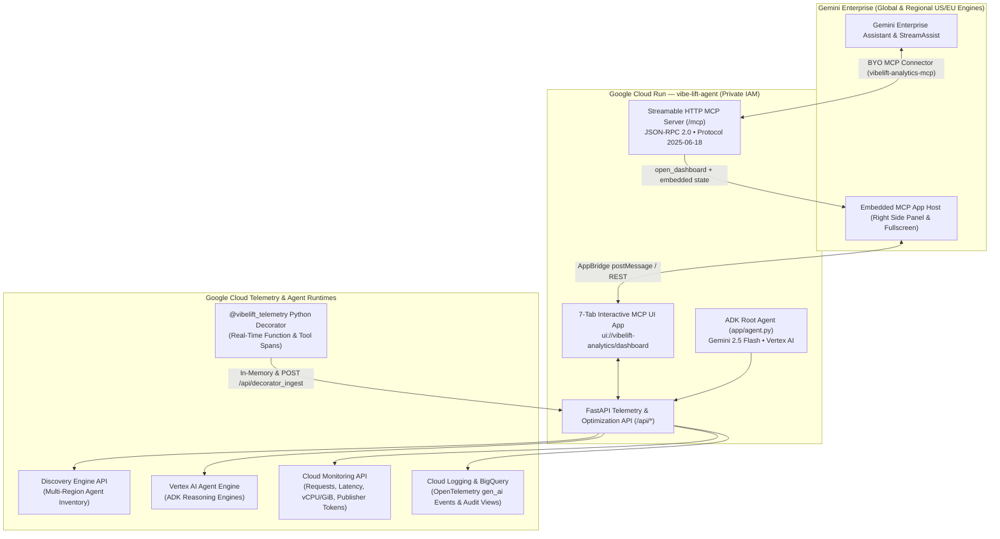
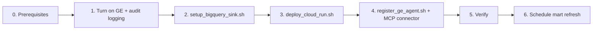

# VibeLift — Gemini Enterprise Agent Fleet Observability, FinOps & Optimization Studio

[](https://github.com/enriquekalven/vibe_lift_agent/actions/workflows/tests.yml)

**VibeLift** is an enterprise observability, prompt cache FinOps, and autonomous multi-objective optimization platform built on Google Cloud with the **Google Agent Development Kit (ADK)**, **FastAPI**, and the **Model Context Protocol (MCP)**.

Designed for production deployment on **Google Cloud Run** and native embedding inside **Gemini Enterprise**, VibeLift enumerates registered agents across global and regional Gemini Enterprise instances, joins inventory with real-time Google Cloud Monitoring and OpenTelemetry `gen_ai` logs, measures prompt cache and skill/MCP token economics, and runs closed-loop prompt optimization across **AlphaEvolve**, **Opus Frontier Critic**, **Google Vizier**, and **Hybrid Ensemble**.

> **Deploying to your own project?** Follow [Deploy in Your Own GCP Project](#deploy-in-your-own-gcp-project): prerequisites, logging, BigQuery, Cloud Run, Gemini Enterprise registration, verification and [troubleshooting](#troubleshooting).

---

## Architecture Overview



---

## Core Capabilities

### 1. Live Gemini Enterprise Agent Fleet (`Tab 0`)
- **Multi-Region Discovery Engine Inventory**: Enumerates every agent deployed across configured Gemini Enterprise engines (`VIBELIFT_GE_ENGINES`, supporting both `global/engine-id` and regional `us/engine-id` or `eu/engine-id` specifications) across all assistants and pages.
- **Joined Cloud Telemetry**:
  - **ADK Agents on Vertex AI Agent Engine**: Joins Cloud Monitoring `reasoning_engine` metrics (request volume, 4xx/5xx error rates, p50/p95 latency, vCPU and memory allocation) with per-agent OpenTelemetry `gen_ai` log events (LLM invocations, input/output tokens, cached tokens, active conversations, and last activity timestamp). Prompt message bodies are never read into the payload.
  - **A2A Agents on Cloud Run**: Joins service-level `run.googleapis.com` request, error, latency, and container allocation metrics from the agent card endpoint.
  - **Low-Code / Workflow & Google-Managed Agents**: Automatically classifies Agent Designer (`lowCodeAgentDefinition`, `workflowAgentDefinition`), Dialogflow, and Google-managed agents (`Deep Research`).
- **Project-Wide Model Economics**: Aggregates Vertex AI publisher model invocations and token counts (`publisher/online_serving/*`) priced against list rate cards alongside Gemini Enterprise `StreamAssist` traffic.
- **Zero Synthetic Fallbacks**: Unavailable telemetry sources return `null` metrics with explicit diagnostics in `source_status` and `errors`. Fleet snapshots are cached in-memory (`VIBELIFT_FLEET_TTL_SECONDS=60`) with rate-limited forced refreshes (`VIBELIFT_FLEET_MIN_REFRESH_SECONDS=10`).

### 2. Prompt Cache Economics & Prefix Breakpoint Diagnostics (`Tab 1`)
- **Turn-by-Turn Token Valuation**: Tracks total input tokens, cached prefix tokens, uncached input tokens, and output tokens across multi-turn agent trajectories using official model rate cards (`gemini-2.5-pro`, `gemini-2.5-flash`, `gemini-2.0-flash`, `claude-3-7-sonnet`, `claude-3-5-sonnet`).
- **Prefix Breakpoint Detection**: Pinpoints the exact line and character offset where dynamic tokens (such as timestamps, session UUIDs, or unpinned tool schemas) invalidate static prefix caching.
- **Custom Multi-Objective Parameters**: Allows operators to register and weight custom optimization parameters (`minimize` or `maximize`) with live baseline-to-current delta tracking.

### 3. Multi-Platform Optimization Studio (`Tab 2`)
- **Pluggable Optimizer Backends**: Supports live switching and side-by-side comparison across four optimization engines:
  - **AlphaEvolve** (`alpha_evolve`) — Evolutionary Pareto-frontier prompt prefix, schema, and context optimization (`DEFAULT`).
  - **Opus Frontier Critic** (`opus_critic`) — Frontier LLM structural prompt refactoring, instruction synthesis, and schema compaction.
  - **Google Vizier** (`vertex_vizier`) — Distributed black-box Bayesian hyperparameter and context-window tuner.
  - **Hybrid Ensemble** (`hybrid_ensemble`) — Combined pipeline uniting Opus structural critique, Google Vizier numerical tuning, and AlphaEvolve Pareto selection.
- **Closed-Loop Safety Guardrails**: Evaluates candidate prompt mutations against accuracy, safety, and latency guardrails—automatically committing Pareto improvements or rolling back regressions when anomalies occur.

### 4. User-Centric FinOps & `@vibelift_telemetry` Decorator (`Tab 3`)
- **Zero-Boilerplate Python Decorator**: Instrument any ADK tool, agent turn, or Python function (sync or async) with `@vibelift_telemetry(agent_id=..., skill_name=..., mcp_tool=...)` to capture real-time wall-clock latency, token consumption, context bloat, and idle ratio metrics.
- **Context Bloat & Idle Cost Attribution**: Separates wasted uncached context bloat (`context_bloat_pct`) and idle compute provisioning overhead (`idle_ratio_pct`) from productive token spend.
- **Per-User & Skill/MCP Token Economics**: Surfaces user-level cache hit rates, waste attribution, and token cost per call across agent skills and MCP tools, alongside prioritized optimization recommendations.

### 5. Native Gemini Enterprise BYO MCP App (`ui://vibelift-analytics/dashboard`)
- **Streamable HTTP MCP Server**: Compliant with MCP specification versions `2025-06-18` and `2025-03-26` at `/mcp`.
- **Responsive Side-Panel & Fullscreen Workspace**: Opens natively in the Gemini Enterprise **Right Side Panel (`pip`)** by default for side-by-side chat analysis, with a one-click **Fullscreen (`fullscreen`)** toggle powered by the MCP AppBridge (`ui/request-display-mode`).
- **Embedded Live State**: Every `open_dashboard` invocation and `resources/read` response embeds a fresh server-side snapshot of `state`, `gcp_telemetry`, and `ge_fleet` directly into the HTML payload so the dashboard renders live fleet data immediately inside sandboxed iframes without waiting on cross-origin XHR calls.

---

## Repository Structure

```text
vibe_lift_agent/
├── app/                         # ADK entry points (agents-cli agent_directory)
│   ├── agent.py                 # ADK root_agent and tools
│   └── fast_api_app.py          # Production ASGI app (Cloud Run CMD)
├── vibelift/                    # Application package
│   ├── server.py                # REST routes + standalone HTTP server
│   ├── mcp_server.py            # MCP JSON-RPC 2.0 server and MCP App bridge
│   ├── fleet.py                 # Gemini Enterprise inventory joined with Monitoring, Logging and Trace
│   ├── finops.py                # Live token economics, spend drift, what-if projections
│   ├── billing_export.py        # Cloud Billing export (BigQuery) reader
│   ├── gcp_telemetry.py         # Cloud Run, Logging and BigQuery collectors
│   ├── telemetry.py             # Rate cards, cache economics, @vibelift_telemetry
│   ├── validator.py             # Deterministic checks + LLM-as-judge audit
│   ├── optimizer.py             # Optimization engine and user analytics
│   ├── long_running_agent.py    # Multi-turn trajectory simulator
│   └── ui/
│       ├── template.py          # Dashboard HTML/JS
│       ├── logo_asset.py        # Embedded brand assets
│       └── static/              # Source logo images
├── tests/                       # Offline test suite, no live API calls (see docs/TESTING.md)
├── deploy/
│   ├── deploy_cloud_run.sh      # Tests, then idempotent Cloud Run + IAM deploy
│   ├── cloudbuild.yaml          # Build -> test -> push -> deploy
│   ├── cloud_run_service.yaml   # Declarative service reference
│   ├── setup_bigquery_sink.sh   # BigQuery datasets, Logging sinks, analytics tables, curated views + mart
│   ├── register_ge_agent.sh     # A2A registration + MCP connector values for a Gemini Enterprise app
│   └── bigquery/
│       ├── provision_ge_mart.py # Curated views + vibelift_mart (apply / refresh / scheduled-query DDL)
│       └── ge_mart/             # SQL templates for the curated and mart layers
├── docs/
│   ├── spec.md                  # Architecture and data-source specification
│   ├── GE_MART.md               # Gemini Enterprise curated views and reporting mart
│   ├── TESTING.md               # Requirement -> test map, CI gates
│   ├── SKILL.md                 # Agent skill reference
│   └── mcp_spec.json            # MCP tool catalog
├── .github/workflows/tests.yml  # CI: full test suite on push and PR
├── Dockerfile
├── pyproject.toml, requirements.txt, constraints.txt
└── agents-cli-manifest.yaml
```

---

## Configuration & Environment Variables

Runtime variables are read by the service (set on Cloud Run by `deploy/deploy_cloud_run.sh`, or in `.env` locally; copy [.env.example](.env.example)). Unset variables use the defaults below.

**Core**

| Variable | Default | Description |
| :--- | :--- | :--- |
| `GOOGLE_CLOUD_PROJECT` | Metadata server / active `gcloud` project | Target GCP Project ID. Falls back to `UNCONFIGURED-PROJECT` if unset so it never queries an unintended project. |
| `GOOGLE_CLOUD_REGION` | `us-central1` | Primary region for Cloud Run and Vertex AI. |
| `GOOGLE_GENAI_USE_VERTEXAI` | `TRUE` (when no API key is set) | Routes ADK `root_agent` model calls through Vertex AI using the runtime service account. |
| `GOOGLE_CLOUD_LOCATION` | `GOOGLE_CLOUD_REGION` | Vertex AI location for ADK model calls. |
| `VIBELIFT_PUBLIC_URL` | `https://SERVICE-PROJECT_NUMBER.REGION.run.app` | Canonical public URL published in the A2A agent card and MCP metadata. |
| `PUBLIC_A2A_URL` | `${VIBELIFT_PUBLIC_URL}/a2a/app` | Explicit override for the `url` field in the A2A agent card. |
| `PORT` / `HOST` | `8080` / `0.0.0.0` | Listen address. |
| `USE_UVICORN` | `0` (deploy sets `1`) | Serve the FastAPI app with uvicorn instead of the stdlib server. |
| `ALLOWED_ORIGINS` | `*` | Comma-separated CORS origin allowlist. |
| `ENABLE_MCP_APP` | `1` | Enables (`1`) or disables (`0`) the `/mcp` JSON-RPC 2.0 server. |
| `MCP_PROTOCOL_VERSION` | `2025-06-18` | Negotiated MCP protocol version (`2025-06-18` or `2025-03-26`). |

**Gemini Enterprise fleet and runtimes**

| Variable | Default | Description |
| :--- | :--- | :--- |
| `VIBELIFT_GE_ENGINES` | `auto` | `auto` discovers every Gemini Enterprise app in `VIBELIFT_GE_LOCATIONS`. Or a comma-separated list of `location/engine_id` (for example `global/my-app,us/my-us-app`); a bare ID uses `VIBELIFT_GE_LOCATION`. If `auto` finds no apps, the dashboard shows an error instead of guessing. |
| `VIBELIFT_GE_LOCATIONS` | `global,us,eu` | Discovery Engine locations scanned by `auto`. |
| `VIBELIFT_GE_LOCATION` | `global` | Default location for engine IDs given without a `location/` prefix. |
| `VIBELIFT_GE_COLLECTION` | `default_collection` | Discovery Engine collection ID. |
| `VIBELIFT_DISCOVER_UNREGISTERED` | `true` (in a real project) | Also discover standalone Agent Engine, Cloud Run and GKE workloads that are not registered in Gemini Enterprise. |
| `VIBELIFT_RE_LOCATIONS` | `us-central1,us-west1,us-east4,europe-west1` | Regions scanned for standalone Vertex AI Agent Engine (Reasoning Engine) instances. |
| `VIBELIFT_MONITORED_SERVICES` | *(empty)* | Optional comma-separated Cloud Run services to include in `/api/gcp_telemetry`. |
| `VIBELIFT_FLEET_TTL_SECONDS` | `60` | In-memory cache TTL (seconds) per telemetry time window. |
| `VIBELIFT_FLEET_MIN_REFRESH_SECONDS` | `10` | Minimum cooldown interval (seconds) between forced fleet refreshes. |
| `VIBELIFT_FLEET_WINDOW_HOURS` | `24` | Default telemetry aggregation window in hours. |
| `VIBELIFT_TOKEN_LOG_MAX_ENTRIES` | `3000` | Maximum OpenTelemetry `gen_ai` log entries scanned per fleet collection. |
| `VIBELIFT_TRACE_MAX_PAGES` | `6` | Maximum Cloud Trace pages read per collection. |
| `VIBELIFT_BACKGROUND_WARMER` | on in Cloud Run | Set to `1` to pre-warm caches in the background when running outside Cloud Run. |

**BigQuery, cost and audit**

| Variable | Default | Description |
| :--- | :--- | :--- |
| `VIBELIFT_GE_CURATED_DATASET` | `ds_ge_curated_staging` | Curated views dataset (see [docs/GE_MART.md](docs/GE_MART.md)). |
| `VIBELIFT_GE_MART_DATASET` | `vibelift_mart` | Reporting mart dataset (`fct_turns`, `fct_sessions`, `agg_daily_usage`). |
| `VIBELIFT_BILLING_EXPORT_TABLE` | *(empty)* | Cloud Billing BigQuery export table (`project.dataset.gcp_billing_export_v1_XXXX`). Empty = billed cost shown as unknown. |
| `VIBELIFT_RATE_CARDS_JSON` | *(empty)* | Optional JSON override for model token pricing rate cards. |
| `VIBELIFT_JUDGE_MODEL` | `gemini-2.5-flash` | Model used by the LLM-as-judge audit. |
| `VIBELIFT_JUDGE_LOCATION` | `us-central1` | Vertex AI location for the judge model. |
| `VIBELIFT_JUDGE_TIMEOUT_S` | `25` | Judge call timeout in seconds. |

**Deploy-script variables** (read by the scripts in `deploy/`, not by the service)

| Variable | Used by | Default | Description |
| :--- | :--- | :--- | :--- |
| `SERVICE_NAME` | all scripts | `vibe-lift-agent` | Cloud Run service name. |
| `VIBELIFT_SKIP_TESTS` | `deploy_cloud_run.sh` | `0` | `1` deploys without running the local test gate (not recommended). |
| `VIBELIFT_INVOKERS` | `deploy_cloud_run.sh` | *(empty)* | Comma-separated IAM members granted `roles/run.invoker` so they can open the dashboard, for example `user:alice@example.com,group:finops@example.com`. |
| `BQ_LOCATION` | `setup_bigquery_sink.sh` | `US` | BigQuery location for all datasets. Keep it the same as your log sinks. |
| `GE_ENGINE_ID` | `register_ge_agent.sh` | *(required)* | Gemini Enterprise app ID (or pass it as the first argument). |
| `GE_LOCATION` | `register_ge_agent.sh` | `global` | Location of that app (`global`, `us`, `eu`). |

---


## Local Development & Testing

### 1. Environment Setup
Use Python 3.12+ and install locked dependencies:

```bash
python3.12 -m venv .venv
source .venv/bin/activate
pip install -r requirements.txt -c constraints.txt
```

### 2. Run the Offline Test Suite
The test suite validates all telemetry calculations, `@vibelift_telemetry` decorator instrumentation, multi-platform optimization mutations, REST routes, MCP JSON-RPC methods, and regional/global Discovery Engine fleet joins without requiring live network calls:

```bash
GOOGLE_APPLICATION_CREDENTIALS=/nonexistent/offline.json \
GOOGLE_CLOUD_PROJECT=test-project \
python -m unittest discover -s tests -t . -v
```
See [docs/TESTING.md](docs/TESTING.md) for which test enforces which requirement.

### 3. Run the Local Server
```bash
python -m vibelift.server --port=8080
```
Open [http://localhost:8080](http://localhost:8080) to inspect the dashboard locally (`make playground` does the same). Locally the server uses your `gcloud auth application-default login` credentials against `GOOGLE_CLOUD_PROJECT`.

---

## Instrumenting Functions with `@vibelift_telemetry`

Decorate any synchronous or asynchronous agent function, skill, or tool to stream real-time execution metrics into **Tab 3 (User-Centric FinOps & Decorator)**:

```python
from vibelift.telemetry import vibelift_telemetry

@vibelift_telemetry(
    agent_id="adk_service_desk",
    user_id="user@your-company.com",
    skill_name="it-ticket-triage",
    mcp_tool="query_ge_agent_fleet",
    model_name="gemini-2.5-flash",
)
def handle_support_request(query: str) -> dict:
    # Return dict or object with optional token usage metadata
    return {
        "status": "resolved",
        "input_tokens": 8200,
        "cached_tokens": 6800,
        "output_tokens": 420,
    }
```

External services can also push telemetry spans over HTTP via `POST /api/decorator_ingest`.

---

## Deploy in Your Own GCP Project

This section takes a fresh Google Cloud project to a working, private VibeLift deployment registered in Gemini Enterprise. Run every command from the repo root. Replace `PROJECT_ID`, `REGION` and `GE_APP_ID` with your values.



### 0. Prerequisites

**Tools on your machine**
- [Google Cloud CLI](https://cloud.google.com/sdk/docs/install) with `bq` (bundled), logged in: `gcloud auth login` and `gcloud auth application-default login`.
- Python 3.12+ with the project dependencies (`deploy_cloud_run.sh` runs the test suite locally before deploying, and `setup_bigquery_sink.sh` runs `provision_ge_mart.py`):
  ```bash
  python3 -m venv .venv && source .venv/bin/activate
  pip install -r requirements.txt -c constraints.txt
  pip install ruff   # optional; the deploy gate runs it when present
  ```
- `agents-cli` (optional, used by `register_ge_agent.sh` to publish the A2A agent). Without it, register the agent in the console.

**Google Cloud**
- A project with billing enabled, selected with `gcloud config set project PROJECT_ID`.
- An existing **Gemini Enterprise app** in that project (VibeLift observes and registers into it; it does not create one). Note its app ID and location (`global`, `us` or `eu`).
- **Your permissions.** Project **Owner** is the simplest. Otherwise you need roughly: Service Usage Admin, Service Account Admin, Role Administrator (for the custom `vibeLiftGeFleetReader` role), Project IAM Admin, Cloud Run Admin, Cloud Build Editor, Artifact Registry Admin, Storage Admin (source upload bucket), Service Account User on the runtime SA, Logs Configuration Writer, BigQuery Admin, and Discovery Engine Admin (agent registration). This list has not been tested as a minimal set; if a step fails with `PERMISSION_DENIED`, the error names the missing permission.

### 1. Turn on Gemini Enterprise and audit logging (console, one time)

The scripts create sinks, but sinks only route logs that are actually written:

1. **Gemini Enterprise user activity logging.** In the Gemini Enterprise console, open each app you want to observe and turn on its user activity / observability logging (the exact label changes between console releases). This produces the `discoveryengine.googleapis.com/gemini_enterprise_user_activity` and `discoveryengine.googleapis.com/gen_ai.client.inference.operation.details` logs. Without them the mart has no turns, sessions or tokens.
2. **Data Access audit logs (optional).** *IAM & Admin > Audit Logs >* `Discovery Engine API` *>* enable *Data Read* and *Data Write*. Admin Activity audit logs are always on; Data Access logs add read/assist calls to `ds_ge_audit_raw` and improve user attribution when activity logs elide the email.

Check the logs exist (after some GE traffic):
```bash
gcloud logging logs list --project=PROJECT_ID | grep discoveryengine
```

### 2. BigQuery datasets, log sinks and reporting mart

```bash
BQ_LOCATION=US ./deploy/setup_bigquery_sink.sh
```

Idempotent. It creates:

| Layer | Objects |
| :--- | :--- |
| Raw datasets (`BQ_LOCATION`) | `ds_ge_assistant_raw`, `ds_ge_search_raw`, `ds_vertex_agents_raw`, `ds_ge_audit_raw`, `ds_security_guardrails_raw`, `vibelift_analytics` |
| Log sinks (partitioned tables) | `sink-ge-assistant-activity`, `sink-ge-search-activity`, `sink-vertex-reasoning-engine`, **`sink-ge-inference-tokens`** (the only source of per-turn tokens), `sink-platform-audit`, `sink-model-armor-sdp`, `vibelift-telemetry-sink`. Each sink's writer identity gets `roles/bigquery.dataEditor` on the project. |
| Analytics tables | `vibelift_analytics.agent_turns`, `agent_eval_runs`, `alpha_evolve_generations`, `agent_registry_snapshots`, view `vw_fleet_finops_summary` |
| Curated views + mart | `ds_ge_curated_staging` (`v_user_activity_curated`, `v_agentic_operations_curated`, `v_consolidated_audit_log`) and `vibelift_mart` (`v_fct_turns`, table `fct_turns`, `fct_sessions`, `agg_daily_usage`), built by `deploy/bigquery/provision_ge_mart.py --apply` |

On a new project the raw tables do not exist until the first logs arrive; the curated views then return no rows instead of failing. The script exits non-zero if the mart step fails and prints the command to re-run just that step. Details of the mart logic: [docs/GE_MART.md](docs/GE_MART.md).

> [!NOTE]
> Sinks only capture log entries written **after** they exist. There is no backfill. After real Gemini Enterprise traffic, rebuild the mart table:
> `python3 deploy/bigquery/provision_ge_mart.py --project=PROJECT_ID --location=US --gcloud-auth --refresh`

> [!WARNING]
> The raw log datasets can contain prompt and response text from Gemini Enterprise activity logs. VibeLift reads only counters and identifiers, but restrict access to the `ds_*_raw` datasets as you would the logs themselves.

### 3. Deploy the Cloud Run service

```bash
# Optional extras:
#   VIBELIFT_INVOKERS="user:alice@example.com,group:finops@example.com"  -> can open the dashboard
#   VIBELIFT_BILLING_EXPORT_TABLE="billing-proj.billing_ds.gcp_billing_export_v1_XXXX"
#   VIBELIFT_GE_ENGINES="global/my-app"   (default: auto)
GOOGLE_CLOUD_REGION=us-central1 ./deploy/deploy_cloud_run.sh
```

The script:
1. Runs bytecode compilation, `ruff` and the offline test suite, and aborts on failure (`VIBELIFT_SKIP_TESTS=1` overrides).
2. Enables `run`, `cloudbuild`, `artifactregistry`, `logging`, `monitoring`, `discoveryengine`, `aiplatform` and `bigquery` APIs.
3. Creates the runtime service account `vibe-lift-runtime-sa@PROJECT_ID.iam.gserviceaccount.com`.
4. Creates/updates the custom role `vibeLiftGeFleetReader` (`discoveryengine.engines.get`, `assistants.list`, `agents.list`, `agents.get`, `agents.manage`) so `agents.list` returns agents created by any user, without agent admin rights.
5. Grants the runtime SA: `discoveryengine.viewer`, `vibeLiftGeFleetReader`, `aiplatform.viewer`, `aiplatform.user` (Gemini calls from the ADK agent and LLM judge), `logging.viewer`, `monitoring.viewer`, `cloudtrace.user`, `run.viewer`, `container.clusterViewer` (GKE discovery), `bigquery.dataViewer`, `bigquery.jobUser`, plus `WRITER` (Data Editor) on the `vibelift_mart` dataset's access list only (the dashboard's *Refresh Mart* button). If the mart does not exist yet, re-run the script after step 2.
6. Deploys the private service (`--no-allow-unauthenticated`, 1 vCPU, 1 GiB, min 1 / max 10 instances) from source.
7. Grants `roles/run.invoker` to the Discovery Engine service agent (`service-PROJECT_NUMBER@gcp-sa-discoveryengine.iam.gserviceaccount.com`) so Gemini Enterprise can call `/mcp`, and to anyone in `VIBELIFT_INVOKERS`.

It is safe to re-run. Env vars are merged, so values set by hand on the service are kept.

**Cost data (optional).** Turn on the Cloud Billing export to BigQuery for your billing account (*Billing > Billing export > BigQuery export*), then grant the runtime SA read access on the export dataset and redeploy with `VIBELIFT_BILLING_EXPORT_TABLE` set:
In the console: *BigQuery > BILLING_DATASET > Sharing > Permissions > Add principal* `vibe-lift-runtime-sa@PROJECT_ID.iam.gserviceaccount.com` with **BigQuery Data Viewer**. (`bq add-iam-policy-binding --dataset` needs allowlisting in many projects, so the console or the dataset access list is the reliable path.)
Without it, token spend is estimated from list prices and billed cost shows as unknown.

**CI/CD alternative.** After the first `deploy_cloud_run.sh` run, [deploy/cloudbuild.yaml](deploy/cloudbuild.yaml) builds, tests, pushes and rolls out new images. Read its header first: the Cloud Build service account needs `roles/run.developer` and `roles/iam.serviceAccountUser` on the runtime SA.
```bash
gcloud builds submit --config=deploy/cloudbuild.yaml .
gcloud builds submit --config=deploy/cloudbuild.yaml --substitutions=_DEPLOY=false .   # build, test, push only
```

### 4. Register in Gemini Enterprise

```bash
GE_LOCATION=global ./deploy/register_ge_agent.sh GE_APP_ID
```

The script checks the service with your identity token, re-applies the Discovery Engine service agent invoker binding, publishes the A2A agent with `agents-cli publish gemini-enterprise --registration-type a2a`, and prints the values for the MCP connector.

Then attach the **BYO MCP connector** (side-panel dashboard) in the console, in the tools / actions / MCP section of your app. Labels change between console releases; the values are:

| Field | Value |
| :--- | :--- |
| Name | `vibelift-analytics-mcp` |
| Endpoint URL | `https://vibe-lift-agent-PROJECT_NUMBER.REGION.run.app/mcp` |
| Transport | Streamable HTTP, JSON-RPC 2.0, MCP `2025-06-18` (also accepts `2025-03-26`) |
| UI resource | `ui://vibelift-analytics/dashboard` (`text/html;profile=mcp-app`) |
| Auth | Keep the service private. Gemini Enterprise calls it as the Discovery Engine service agent, which step 3 granted `roles/run.invoker`. |

Exposed MCP tools:
- `open_dashboard`: renders the VibeLift dashboard in the Gemini Enterprise right side panel (with Fullscreen and PDF export).
- `query_ge_agent_fleet`: live inventory and telemetry for all agents in Gemini Enterprise.
- `query_project_telemetry`: Cloud Run service metrics and BigQuery triage log summaries.
- `calculate_prompt_cache_economics`: prompt prefix cache hit rates and savings.
- `run_alpha_evolve_generation`: one closed-loop optimization generation (`alpha_evolve`, `opus_critic`, `vertex_vizier`, `hybrid_ensemble`).
- `get_vibelift_state`: active agent state, parameters and turn trajectory.

### 5. Verify

```bash
URL=https://vibe-lift-agent-$(gcloud projects describe PROJECT_ID --format='value(projectNumber)').REGION.run.app
TOKEN=$(gcloud auth print-identity-token)

curl -s -H "Authorization: Bearer $TOKEN" $URL/health                        # {"status": "ok"}
curl -s -H "Authorization: Bearer $TOKEN" "$URL/api/ge_fleet?window_hours=24" | python3 -m json.tool | head -40
curl -s -H "Authorization: Bearer $TOKEN" "$URL/api/user_centric_finops?window_hours=168" | python3 -m json.tool | head -40
curl -s -X POST -H "Authorization: Bearer $TOKEN" -H 'Content-Type: application/json' \
  -H 'Accept: application/json, text/event-stream' \
  -d '{"jsonrpc":"2.0","id":1,"method":"tools/list"}' $URL/mcp | head -c 300
```

Check `errors` and `source_status` in `/api/ge_fleet`: every unavailable source is listed there with the reason (usually a missing role or API) instead of fake numbers.

**Open the dashboard.** The service is private, so browse through the Cloud Run proxy (uses your credentials):
```bash
gcloud run services proxy vibe-lift-agent --project=PROJECT_ID --region=REGION --port=8080
# then open http://localhost:8080
```
Teammates need `roles/run.invoker` on the service (`VIBELIFT_INVOKERS` in step 3) to do the same. In Gemini Enterprise, ask the assistant to "open the VibeLift dashboard".

### 6. Keep the mart fresh

`fct_turns` is a materialized table. Rebuild it on a schedule with a BigQuery scheduled query (needs the BigQuery Data Transfer API):
```bash
gcloud services enable bigquerydatatransfer.googleapis.com --project=PROJECT_ID
python3 deploy/bigquery/provision_ge_mart.py --project=PROJECT_ID --print-refresh > /tmp/vibelift_refresh.sql
bq mk --transfer_config --project_id=PROJECT_ID --location=US \
  --data_source=scheduled_query --display_name="VibeLift fct_turns refresh" \
  --schedule="every 1 hours" \
  --params="{\"query\": $(python3 -c 'import json; print(json.dumps(open("/tmp/vibelift_refresh.sql").read()))')}"
```
Operators can also click **Refresh Mart** in the dashboard, or run `provision_ge_mart.py --refresh`.

### Executive PDF Export

Operators can filter by Gemini Enterprise app, standalone runtimes and time window (1 hour to 1 year), then click **Export PDF** in the dashboard action bar to get a print-optimized, multi-page report. Dedicated `@media print` CSS hides interactive controls and keeps KPI cards, charts and agent tables.

---


## REST API & MCP Endpoint Reference

| Endpoint | Method | Description |
| :--- | :--- | :--- |
| `/` , `/ui` , `/app` | `GET` | Interactive VibeLift Analytics, FinOps & Optimization Dashboard |
| `/mcp` | `POST` | Streamable JSON-RPC 2.0 MCP server (`initialize`, `tools/list`, `tools/call`, `resources/list`, `resources/read`) |
| `/mcp` | `DELETE` | Terminates an MCP session (`HTTP 204`) |
| `/health` | `GET` | External Cloud Run health check (`{"status": "ok"}`) |
| `/healthz` | `GET` | Container-internal & local health probe (`{"ok": true}`) |
| `/.well-known/agent-card.json` | `GET` | A2A protocol metadata card (also served at `/a2a/app/.well-known/agent-card.json`) |
| `/api/state` | `GET` | Full runtime state including optimization platforms, decorator telemetry, and User-Centric FinOps |
| `/api/ge_fleet` | `GET` | Live Gemini Enterprise agent fleet inventory & telemetry (`?window_hours=24&force_refresh=false`) |
| `/api/sync_ge_fleet` | `POST` | Triggers an immediate Gemini Enterprise fleet collection (`window_hours`) |
| `/api/gcp_telemetry` | `GET` | Live Google Cloud Run service metrics and BigQuery triage log telemetry |
| `/api/sync_gcp_telemetry` | `POST` | Syncs live Google Cloud Logging turns into the active agent profile |
| `/api/user_centric_finops` | `GET` | User-centric FinOps plus `session_drilldown`: per-user session token rollup (sessions, turns, input/output/cached/reasoning/total tokens) and a per-session turn-by-turn token dictionary from `vibelift_mart.fct_sessions` / `fct_turns` (`?window_hours=168`). Token counts only, no prompt text |
| `/api/select_optimizer` | `POST` | Switches active optimization platform (`platform_id`: `alpha_evolve`, `opus_critic`, `vertex_vizier`, `hybrid_ensemble`) |
| `/api/decorator_ingest` | `POST` | Ingests a real-time `@vibelift_telemetry` span from an instrumented function or tool |
| `/api/select_agent` | `POST` | Switches the active optimization agent profile (`agent_id`) |
| `/api/add_parameter` | `POST` | Registers or updates a weighted multi-objective optimization parameter |
| `/api/inject_anomaly` | `POST` | Simulates a production prefix-cache or latency regression for guardrail testing |
| `/api/evolve_generation` | `POST` | Runs a closed-loop optimization generation (`platform_id` optional) |
| `/api/reset` | `POST` | Resets optimizer trajectories, parameters, and decorator telemetry to baseline |

---

## Security & Operational Guardrails

- **Private IAM Authentication**: Cloud Run is deployed with `--no-allow-unauthenticated`. Only principals granted `roles/run.invoker` (including the Discovery Engine service agent) can invoke `/`, `/api/*`, or `/mcp`.
- **Strict Content Security Policy (CSP)**: Every HTML response sets `Content-Security-Policy` headers permitting framing by `*.cloud.google.com`, `*.corp.google.com`, and `*.pantheon.corp.google.com` while blocking `object-src` and untrusted scripts.
- **Privacy-Preserving Log Ingestion**: `vibelift/fleet.py` extracts only numeric token counters, model names, and anonymized conversation identifiers from OpenTelemetry `gen_ai` logs; user prompts and model completions are never stored or returned.
- **Reference-ID Error Sanitization**: Unhandled exceptions in MCP tool calls and JSON-RPC handlers log full stack traces to Cloud Logging with a correlation `ref=<id>` while returning only the sanitized exception class and reference ID to the caller.
---

## Troubleshooting

| Symptom | Likely cause | Fix |
| :--- | :--- | :--- |
| `403` from the service in a browser or `curl` | Service is private | Use `gcloud run services proxy` or an identity token; grant `roles/run.invoker` via `VIBELIFT_INVOKERS`. |
| Gemini Enterprise gets `403` from `/mcp` | Discovery Engine service agent missing or not an invoker | `gcloud beta services identity create --service=discoveryengine.googleapis.com --project=PROJECT_ID`, then re-run `deploy_cloud_run.sh` (or `register_ge_agent.sh`). |
| Fleet tab empty; error "No Gemini Enterprise apps found" | `auto` found no apps, or the SA lacks `discoveryengine.engines.list` | Check the app exists in `global`/`us`/`eu`; set `VIBELIFT_GE_ENGINES=location/app_id`; re-run the deploy script to re-apply roles. |
| Fleet shows only agents you created | Custom role missing `discoveryengine.agents.manage` | Re-run `deploy_cloud_run.sh` (it recreates/undeletes `vibeLiftGeFleetReader`). |
| Sessions/users tab empty | No GE activity logs, or no traffic since the sinks were created | Step 1 (logging on), generate GE traffic, then `provision_ge_mart.py --refresh`. |
| Sessions present but tokens `—`/empty | Inference log not routed to BigQuery | Re-run `setup_bigquery_sink.sh` (creates `sink-ge-inference-tokens`); tokens appear for new traffic after the next refresh. |
| `provision_ge_mart.py` shows a source as `WRONG_LOCATION` | Raw dataset is in a different BigQuery location than `--location` | Keep all datasets in one location (`BQ_LOCATION`), or pass the matching `--location`. |
| *Refresh Mart* button fails | Runtime SA lacks write access on `vibelift_mart` | Re-run `deploy_cloud_run.sh` after the mart exists (adds the runtime SA as `WRITER` on that dataset). |
| Judge/ADK agent errors mentioning `aiplatform.endpoints.predict` | Runtime SA lacks `roles/aiplatform.user` | Re-run `deploy_cloud_run.sh`. |
| Billed cost shows unknown | `VIBELIFT_BILLING_EXPORT_TABLE` unset or unreadable | See "Cost data" in step 3. |
| Deploy aborts before building | Local tests or `ruff` failed, or dependencies not installed | `pip install -r requirements.txt -c constraints.txt`, then fix the failure shown. |
| `IAM grant(s) failed` warning at the end of a script | Your account cannot set IAM policy | Ask a project Owner to re-run the script, or apply the listed grants. |

---

## Teardown

Removes everything the scripts created (irreversible for the BigQuery data):
```bash
PROJECT_ID=your-project; REGION=us-central1
gcloud run services delete vibe-lift-agent --project=$PROJECT_ID --region=$REGION
for s in sink-ge-assistant-activity sink-ge-search-activity sink-vertex-reasoning-engine sink-ge-inference-tokens \
         sink-platform-audit sink-model-armor-sdp vibelift-telemetry-sink; do
  gcloud logging sinks delete $s --project=$PROJECT_ID --quiet
done
for d in vibelift_mart ds_ge_curated_staging vibelift_analytics ds_ge_assistant_raw ds_ge_search_raw \
         ds_vertex_agents_raw ds_ge_audit_raw ds_security_guardrails_raw; do
  bq rm -r -f --dataset $PROJECT_ID:$d
done
gcloud iam roles delete vibeLiftGeFleetReader --project=$PROJECT_ID
gcloud iam service-accounts delete vibe-lift-runtime-sa@$PROJECT_ID.iam.gserviceaccount.com --project=$PROJECT_ID
```
Remove the VibeLift agent and MCP connector from the Gemini Enterprise app in the console, and delete any scheduled query you created in step 6.
