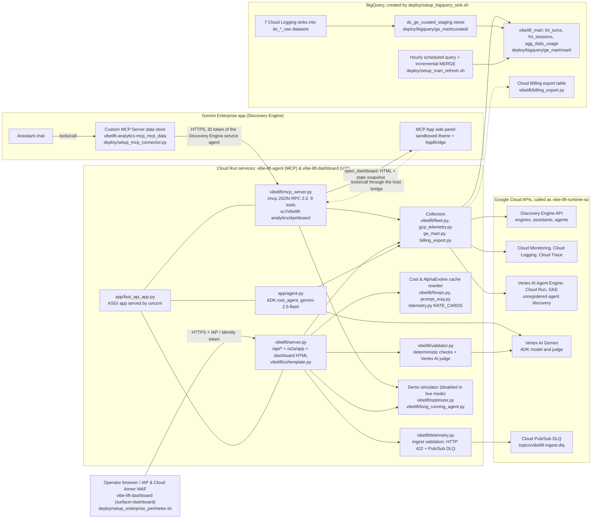

# VibeLift architecture

This page describes what the code in this repository does today. Every box in the diagram names the file or Google Cloud resource behind it. The legend says which parts read live data, which part is a simulator, and which pieces are not configured.

## Diagram

## Legend

| Box | Source | Status |
| :--- | :--- | :--- |
| ASGI app | [app/fast_api_app.py](../app/fast_api_app.py) | Builds the ADK FastAPI app, then registers the MCP, A2A (`/a2a/app`), and REST routes. If ADK fails to load, it serves the VibeLift routes without the ADK API. |
| MCP server | [vibelift/mcp_server.py](../vibelift/mcp_server.py) | Live. Streamable HTTP, JSON-RPC 2.0, MCP `2025-06-18` (also `2025-03-26`). 9 tools; read-only tools set `readOnlyHint`, so Gemini Enterprise asks the user to confirm the two that change state (`run_alpha_evolve_generation`, `set_agent_trace_logging`). |
| REST API, A2A and dashboard | [vibelift/server.py](../vibelift/server.py), [vibelift/ui/template.py](../vibelift/ui/template.py) | Live. Self-contained HTML/JS dashboard with 4 basic tabs and 3 advanced tabs, served with a `Content-Security-Policy` header (`DASHBOARD_SECURITY_HEADERS`), plus a live A2A JSON-RPC 2.0 endpoint (`POST /a2a/app`). On a real project, simulator buttons and panels are hidden (`sim-panel`) and simulator endpoints return `DISABLED_IN_LIVE_MODE`. |
| ADK agent | [app/agent.py](../app/agent.py) | Live. 10 tools that call the same controller in-process. |
| Collectors | [vibelift/fleet.py](../vibelift/fleet.py), [vibelift/gcp_telemetry.py](../vibelift/gcp_telemetry.py), [vibelift/ge_mart.py](../vibelift/ge_mart.py), [vibelift/billing_export.py](../vibelift/billing_export.py) | Live reads. A source that fails shows up in `source_status` / `errors`, with metrics as `null` and no made-up numbers. Supports runtime SHA-256 PII email pseudonymization (`VIBELIFT_PII_REDACT=1`) and BigQuery Data Catalog Policy Tag column masking (`build_pii_policy_tag_ddl`). |
| Cost & AlphaEvolve cache rewriter | [vibelift/finops.py](../vibelift/finops.py), [vibelift/prompt_xray.py](../vibelift/prompt_xray.py), [vibelift/telemetry.py](../vibelift/telemetry.py), [experiments/prompt_cache_evolve/](../experiments/prompt_cache_evolve/) | Measured token counts multiplied by **list prices in `RATE_CARDS`**. `propose_cache_friendly_rewrite` in `vibelift/prompt_xray.py` was evolved via the AlphaEvolve harness (`experiments/prompt_cache_evolve/`, lifting `composite_cache_savings_score` from `0.7321` to `0.9957` across 12 multi-turn enterprise prompt benchmarks). |
| Plain-English search | [vibelift/optimizer.py](../vibelift/optimizer.py) (`verify_nl2sql_sql`, `NL2SQL_MAX_BYTES_BILLED`), [vibelift/server.py](../vibelift/server.py) (`query_nl2sql`) | Live on a real project. The question picks one of 5 fixed `SELECT` templates over `vibelift_mart`; its text never enters the SQL. Each query is checked (one read-only statement, backticked tables in the mart only) and sent with a 100 MB `maximumBytesBilled` cap. Demo mode returns example rows labeled as simulator output. |
| Validator | [vibelift/validator.py](../vibelift/validator.py) | Live. Deterministic grounding checks, plus an optional Vertex AI Gemini judge (`VIBELIFT_JUDGE_MODEL`, default `gemini-2.5-flash`). |
| Ingest validation & Pub/Sub DLQ | [vibelift/telemetry.py](../vibelift/telemetry.py), [deploy/setup_enterprise_perimeter.sh](../deploy/setup_enterprise_perimeter.sh) | Live. Invalid bodies to `/api/decorator_ingest`, `/api/aive_log` and `/api/csat_rating` get HTTP 422, are stored as values-free dead letters (`GET /api/dead_letters`), and are published to the Cloud Pub/Sub Dead-Letter Queue topic (`projects/project-maui/topics/vibelift-ingest-dlq`, configured via `VIBELIFT_DLQ_PUBSUB_TOPIC`). |
| Demo simulator (branch-isolated & live-gated) | [vibelift/optimizer.py](../vibelift/optimizer.py), [vibelift/long_running_agent.py](../vibelift/long_running_agent.py) | **Disabled in live mode** (`DISABLED_IN_LIVE_MODE` unless `VIBELIFT_ENABLE_SIMULATOR=1`); full interactive simulator preserved on `feature/what-if-simulator`. |
| BigQuery sinks, curated views, mart | [deploy/setup_bigquery_sink.sh](../deploy/setup_bigquery_sink.sh), [deploy/bigquery/provision_ge_mart.py](../deploy/bigquery/provision_ge_mart.py), [deploy/bigquery/ge_mart/](../deploy/bigquery/ge_mart/) | Live in `project-maui`. Raw logs, then curated views, then the mart (`fct_turns`, `fct_sessions`, `agg_daily_usage`). |
| Scheduled & incremental refresh | [deploy/setup_mart_refresh.sh](../deploy/setup_mart_refresh.sh), [vibelift/ge_mart.py](../vibelift/ge_mart.py) | Live. Supports both hourly scheduled rebuilds and partition-pruned incremental `MERGE INTO` (`build_incremental_merge_fct_turns_dml`, `POST /api/ge_mart/refresh` with `{"incremental": true, "lookback_days": 3}`). |
| Invariant checks | [deploy/bigquery/verify_ge_mart_invariants.py](../deploy/bigquery/verify_ge_mart_invariants.py) | 13 conservation and reconciliation checks across raw, curated and mart layers. |
| Billing export | [vibelift/billing_export.py](../vibelift/billing_export.py) | Reads real invoice spend when `VIBELIFT_BILLING_EXPORT_TABLE` is connected; otherwise the Cost tab shows an explicit `not configured` status and labels figures as list-price estimates. |

## Request paths

1. **Gemini Enterprise chat to MCP.** The assistant calls a tool on the Custom MCP Server data store. Gemini Enterprise sends the request to `https://vibe-lift-agent-PROJECT_NUMBER.REGION.run.app/mcp` with a Google-signed ID token for its Discovery Engine service agent in `X-Serverless-Authorization`. Cloud Run IAM checks `roles/run.invoker` before the container sees the request.
2. **Side panel.** `open_dashboard` returns the dashboard HTML and a server-side state snapshot. Gemini Enterprise renders it in a sandboxed iframe, with the CSP domains from the MCP resource `_meta.ui.csp`. Refreshes are MCP `tools/call` messages sent through the host bridge, not browser HTTP calls.
3. **Standalone dashboard (`vibe-lift-dashboard`).** Protected by Cloud Run native Identity-Aware Proxy (`--iap`) and Cloud Armor WAF (`vibelift-waf-policy` + Serverless NEG `vibelift-dashboard-neg`). Operators can also connect via `gcloud run services proxy`.
4. **A2A JSON-RPC 2.0 (`POST /a2a/app`).** Executes `tasks/send` and `message/send` requests against live VibeLift skills (`query_ge_agent_fleet`, `query_project_telemetry`, `xray_prompt_cache`, `calculate_prompt_cache_economics`).
5. **Instrumented agents.** `@vibelift_telemetry` records events in the agent's own process. Other services can POST the same event to `/api/decorator_ingest`, which validates it first and routes rejected payloads to the Cloud Pub/Sub DLQ (`vibelift-ingest-dlq`).
6. **Mart.** Cloud Logging sinks copy Gemini Enterprise and Vertex AI logs into `ds_*_raw`. Curated views read those tables, and `vibelift_mart.fct_turns` is updated via hourly scheduled query or partition-pruned incremental `MERGE INTO`.

## Security controls in place

- **Private service, IAP and surface split (`VIBELIFT_SURFACE` / `VIBELIFT_SPLIT_EDGE`).** Deployed with `--no-allow-unauthenticated`; a request without an identity token gets HTTP 403. Setting `VIBELIFT_SPLIT_EDGE=1` in [deploy/deploy_cloud_run.sh](../deploy/deploy_cloud_run.sh) splits the edge into `vibe-lift-agent` (`VIBELIFT_SURFACE=mcp`: `/mcp`, `/a2a/app`, `/api/health` and the agent card, invoked by the Discovery Engine service agent) and `vibe-lift-dashboard` (`VIBELIFT_SURFACE=dashboard` with Cloud Run native `--iap`: browser dashboard and `/api/*` only, `/mcp` disabled).
- **Cloud Armor WAF & VPC-SC Enterprise Perimeter ([deploy/setup_enterprise_perimeter.sh](../deploy/setup_enterprise_perimeter.sh)).** Provisions the live Cloud Armor security policy `vibelift-waf-policy` (Rule 1000: OWASP SQLi `sqli-v33-stable` + XSS `xss-v33-stable` deny-403; Rule 2000: 120 req/min rate-based ban), Serverless NEG `vibelift-dashboard-neg`, Cloud Pub/Sub DLQ topic `vibelift-ingest-dlq`, BigQuery Data Catalog Policy Tag column masking (`user_email`), and customer-org VPC Service Controls perimeter (`vibelift_ge_perimeter`).
- **Dedicated runtime service account** `vibe-lift-runtime-sa` with viewer roles, plus the custom role `vibeLiftGeFleetReader` ([deploy/deploy_cloud_run.sh](../deploy/deploy_cloud_run.sh)). The custom role includes two write permissions, `discoveryengine.agents.manage` (needed so `agents.list` returns agents created by other users) and `discoveryengine.agents.update` (used only by the trace-logging buttons). It has no create, delete or `setIamPolicy`.
- **Values-free audit and Cloud Pub/Sub dead-letter queue.** Ingest records and rejections are written as structured JSON to the `vibelift.audit_sink` logger and published to `projects/PROJECT_ID/topics/vibelift-ingest-dlq` (`VIBELIFT_DLQ_PUBSUB_TOPIC`). Rejected payloads record only key names, byte size and SHA-256 digest—never raw values.
- **PII column masking and runtime pseudonymization.** `vibelift/ge_mart.py` provides `build_pii_policy_tag_ddl()` to attach BigQuery Data Catalog Policy Tags (`Fine-Grained Reader` masking) to `user_email`, and `VIBELIFT_PII_REDACT=1` hashes user emails with SHA-256 (`user-<12hex>@domain`) across all mart readers before data leaves the server.
- **Dashboard CSP.** `/`, `/ui` and `/app` send `Content-Security-Policy` (scripts and fetches limited to the same origin, `object-src 'none'`, `base-uri 'none'`), `X-Content-Type-Options: nosniff` and `Referrer-Policy: no-referrer`. `'unsafe-inline'` remains because the page uses an inline script and inline handlers.
- **Read-only plain-English search.** Fixed templates, a fail-closed SQL check before every query, a 100 MB billing cap per query, and no query at all when the question contains a write keyword.
- **Error sanitization.** MCP tool and method failures log the stack trace with a `ref=<id>` and return only the reference to the caller ([vibelift/mcp_server.py](../vibelift/mcp_server.py)).
- **Human confirmation.** The MCP tools that change state are not marked read-only, so Gemini Enterprise asks the user before running them.
- **Guardrail logs.** The `sink-model-armor-sdp` sink copies Model Armor and Sensitive Data Protection log entries to `ds_security_guardrails_raw`. VibeLift reads those logs; it does not call Model Armor or DLP itself.

## Known gaps

| Gap | Why | Compensating control today |
| :--- | :--- | :--- |
| VPC-SC perimeter requires customer org-level `ACCESS_POLICY_ID` | Organization-level Access Context Manager policies are managed by the customer org admin | `deploy/setup_enterprise_perimeter.sh` automates `gcloud access-context-manager perimeters create vibelift_ge_perimeter` when `ACCESS_POLICY_ID` is supplied; private Cloud Run IAM + split edge (`--iap`) enforce authentication in every project |
| Gemini Enterprise MCP endpoint (`vibe-lift-agent`) uses `*.run.app` ingress | Gemini Enterprise's `BYO_MCP` connector only attaches `X-Serverless-Authorization` ID tokens to the default `*.run.app` domain | Edge split (`VIBELIFT_SPLIT_EDGE=1`) keeps `/mcp` locked to `service-PROJECT_NUMBER@gcp-sa-discoveryengine.iam.gserviceaccount.com` while placing `vibe-lift-dashboard` behind `--iap`, `vibelift-dashboard-neg` and Cloud Armor `vibelift-waf-policy` |
| Cloud Billing export is optional per billing account | Requires billing-account export to BigQuery (`VIBELIFT_BILLING_EXPORT_TABLE`) | When unset, the Cost tab reports `not configured` and labels token costs as list-price estimates |
| In-memory decorator ring buffer is per instance | Decorator events live in memory per Cloud Run instance while rejected ingest payloads are durability-backed by Cloud Pub/Sub (`vibelift-ingest-dlq`) | Structured JSON audit records are also emitted to Cloud Logging (`vibelift.audit_sink`) and queried from BigQuery |
| Hardcoded list prices | No live Cloud Billing Catalog API sync | Rate cards verified against Vertex AI pricing page are documented in `vibelift/telemetry.py` (`VIBELIFT_RATE_CARDS_JSON` overrides); unknown models stay `None` (unpriced) |
| `'unsafe-inline'` in the dashboard CSP | Self-contained single-file MCP App HTML uses inline script and `onclick` handlers | No external origins are allowed; every fetch is same-origin |

