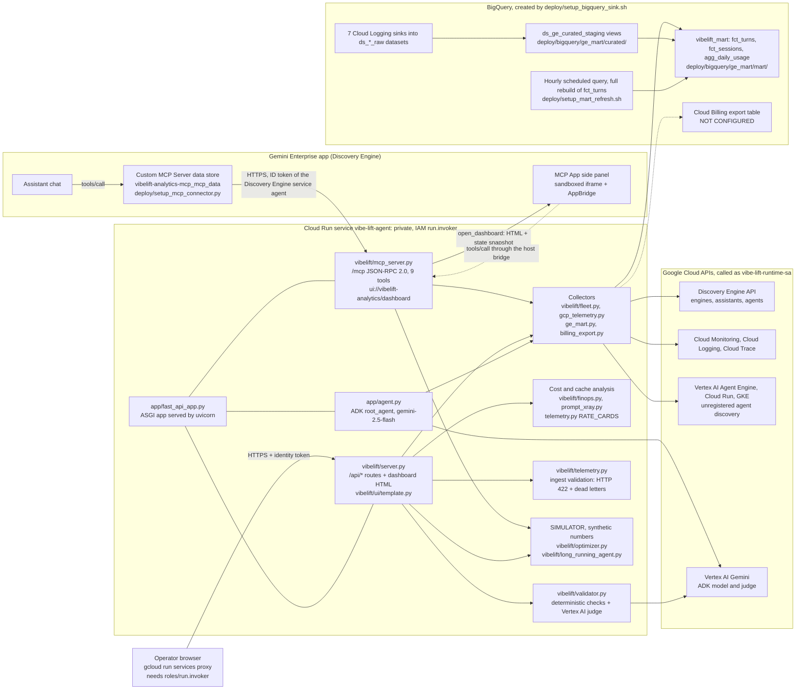

# VibeLift architecture

This page describes what the code in this repository does today. Every box in the diagram names the file or Google Cloud resource behind it. The legend says which parts read live data, which part is a simulator, and which pieces are not configured.

## Diagram

## Legend

| Box | Source | Status |
| :--- | :--- | :--- |
| ASGI app | [app/fast_api_app.py](../app/fast_api_app.py) | Builds the ADK FastAPI app (`get_fast_api_app`, A2A disabled), then registers the MCP and REST routes. If ADK fails to load, it serves the VibeLift routes without the ADK API. |
| MCP server | [vibelift/mcp_server.py](../vibelift/mcp_server.py) | Live. Streamable HTTP, JSON-RPC 2.0, MCP `2025-06-18` (also `2025-03-26`). 9 tools; read-only tools set `readOnlyHint`, so Gemini Enterprise asks the user to confirm the two that change state (`run_alpha_evolve_generation`, `set_agent_trace_logging`). |
| REST API and dashboard | [vibelift/server.py](../vibelift/server.py), [vibelift/ui/template.py](../vibelift/ui/template.py) | Live. A self-contained HTML/JS dashboard with 4 basic tabs and 3 advanced tabs, served with a `Content-Security-Policy` header (`DASHBOARD_SECURITY_HEADERS`). On a real project, panels that only have simulator values are hidden. |
| ADK agent | [app/agent.py](../app/agent.py) | Live. 10 tools that call the same controller in-process. |
| Collectors | [vibelift/fleet.py](../vibelift/fleet.py), [vibelift/gcp_telemetry.py](../vibelift/gcp_telemetry.py), [vibelift/ge_mart.py](../vibelift/ge_mart.py), [vibelift/billing_export.py](../vibelift/billing_export.py) | Live reads. A source that fails shows up in `source_status` / `errors`, with metrics as `null` and no made-up numbers. The billing reader reports `not configured` here. |
| Cost and cache analysis | [vibelift/finops.py](../vibelift/finops.py), [vibelift/prompt_xray.py](../vibelift/prompt_xray.py), [vibelift/telemetry.py](../vibelift/telemetry.py) | Measured token counts multiplied by **list prices hardcoded in `RATE_CARDS`**. These are estimates, not billed cost. A model with no rate card is left unpriced and counted, never priced with another model's card. Compute for unregistered runtimes is shown as measured usage (vCPU-hours, GiB-hours, instance-hours), not dollars. |
| Plain-English search | [vibelift/optimizer.py](../vibelift/optimizer.py) (`verify_nl2sql_sql`, `NL2SQL_MAX_BYTES_BILLED`), [vibelift/server.py](../vibelift/server.py) (`query_nl2sql`) | Live on a real project. The question picks one of 5 fixed `SELECT` templates over `vibelift_mart`; its text never enters the SQL. Each query is checked (one read-only statement, backticked tables in the mart only) and sent with a 100 MB `maximumBytesBilled` cap. Demo mode returns example rows labeled as simulator output. |
| Validator | [vibelift/validator.py](../vibelift/validator.py) | Live. Deterministic grounding checks, plus an optional Vertex AI Gemini judge (`VIBELIFT_JUDGE_MODEL`, default `gemini-2.5-flash`). |
| Ingest validation | [vibelift/telemetry.py](../vibelift/telemetry.py) | Live. Invalid bodies to `/api/decorator_ingest`, `/api/aive_log` and `/api/csat_rating` get HTTP 422 and are kept as values-free dead letters: key names, size and SHA-256 only, newest 50, in memory. Prompt text is stored only as a count, a character total and a SHA-256 / HMAC digest. |
| Simulator | [vibelift/optimizer.py](../vibelift/optimizer.py), [vibelift/long_running_agent.py](../vibelift/long_running_agent.py) | **Simulated.** Fixed improvement factors applied to demo profiles. It calls no optimizer and no model, reads no logs, and changes no agent. Live mode hides simulated turns. |
| BigQuery sinks, curated views, mart | [deploy/setup_bigquery_sink.sh](../deploy/setup_bigquery_sink.sh), [deploy/bigquery/provision_ge_mart.py](../deploy/bigquery/provision_ge_mart.py), [deploy/bigquery/ge_mart/](../deploy/bigquery/ge_mart/) | Live in `project-maui`. Raw logs, then curated views, then the mart. |
| Scheduled refresh | [deploy/setup_mart_refresh.sh](../deploy/setup_mart_refresh.sh) | Live. An hourly BigQuery Data Transfer scheduled query that runs `CREATE OR REPLACE` on `fct_turns` (a full rebuild, not incremental). |
| Invariant checks | [deploy/bigquery/verify_ge_mart_invariants.py](../deploy/bigquery/verify_ge_mart_invariants.py) | Manual. 13 conservation and reconciliation checks; CI, deploy and the refresh do not run them. |
| Billing export | [vibelift/billing_export.py](../vibelift/billing_export.py) | **Not configured.** This project has no billing-export access, so the Cost tab shows an explicit "not configured" status and per-user cost is a list-price estimate. |

## Request paths

1. **Gemini Enterprise chat to MCP.** The assistant calls a tool on the Custom MCP Server data store. Gemini Enterprise sends the request to `https://vibe-lift-agent-PROJECT_NUMBER.REGION.run.app/mcp` with a Google-signed ID token for its Discovery Engine service agent in `X-Serverless-Authorization`. Cloud Run IAM checks `roles/run.invoker` before the container sees the request.
2. **Side panel.** `open_dashboard` returns the dashboard HTML and a server-side state snapshot. Gemini Enterprise renders it in a sandboxed iframe, with the CSP domains from the MCP resource `_meta.ui.csp`. Refreshes are MCP `tools/call` messages sent through the host bridge, not browser HTTP calls.
3. **Standalone dashboard.** An operator with `roles/run.invoker` runs `gcloud run services proxy` and opens the dashboard. The browser calls `/api/*` on the same origin.
4. **Instrumented agents.** `@vibelift_telemetry` records events in the agent's own process. Other services can POST the same event to `/api/decorator_ingest`, which validates it first.
5. **Mart.** Cloud Logging sinks copy Gemini Enterprise and Vertex AI logs into `ds_*_raw`. Curated views read those tables, and the scheduled query rebuilds `vibelift_mart.fct_turns` every hour. The service reads the mart; it does not write to BigQuery. The one exception is the dashboard's *Refresh Mart* button, which rebuilds the mart table.

## Security controls in place

- **Private service and surface split (`VIBELIFT_SURFACE` / `VIBELIFT_SPLIT_EDGE`).** Deployed with `--no-allow-unauthenticated`; a request without an identity token gets HTTP 403. Setting `VIBELIFT_SPLIT_EDGE=1` in `deploy/deploy_cloud_run.sh` splits the edge into `vibe-lift-agent` (`VIBELIFT_SURFACE=mcp`: `/mcp`, `/api/health` and the agent card only, invoked by the Discovery Engine service agent) and `vibe-lift-dashboard` (`VIBELIFT_SURFACE=dashboard` with Cloud Run native `--iap`: browser dashboard and `/api/*` only, `/mcp` disabled).
- **Dedicated runtime service account** `vibe-lift-runtime-sa` with viewer roles, plus the custom role `vibeLiftGeFleetReader` ([deploy/deploy_cloud_run.sh](../deploy/deploy_cloud_run.sh)). The custom role includes two write permissions, `discoveryengine.agents.manage` (needed so `agents.list` returns agents created by other users) and `discoveryengine.agents.update` (used only by the trace-logging buttons). It has no create, delete or `setIamPolicy`.
- **Values-free audit and dead letters.** Ingest records and rejections are written as structured JSON to the `vibelift.audit_sink` logger. VibeLift's own records keep prompt text only as a count, a character total and a digest.
- **Where prompt text and emails do exist.** The mart's `fct_turns` table has `prompt_preview`, `response_preview`, `tool_output_preview`, `uploaded_file_names` and `user_email` columns, copied from Gemini Enterprise activity logs by the curated views. The service code never reads the preview columns; the plain-English search's session and user templates return `user_email` to invokers. The opt-in Prompt Cache X-Ray live mode (`VIBELIFT_PROMPT_XRAY_LIVE=1`) reads logged prompts from the prompt-log bucket and shows them to invokers.
- **Dashboard CSP.** `/`, `/ui` and `/app` send `Content-Security-Policy` (scripts and fetches limited to the same origin, `object-src 'none'`, `base-uri 'none'`), `X-Content-Type-Options: nosniff` and `Referrer-Policy: no-referrer`. `'unsafe-inline'` remains because the page uses an inline script and inline handlers.
- **Read-only plain-English search.** Fixed templates, a fail-closed SQL check before every query, a 100 MB billing cap per query, and no query at all when the question contains a write keyword.
- **Error sanitization.** MCP tool and method failures log the stack trace with a `ref=<id>` and return only the reference to the caller ([vibelift/mcp_server.py](../vibelift/mcp_server.py)).
- **Human confirmation.** The MCP tools that change state are not marked read-only, so Gemini Enterprise asks the user before running them.
- **Guardrail logs.** The `sink-model-armor-sdp` sink copies Model Armor and Sensitive Data Protection log entries to `ds_security_guardrails_raw`. VibeLift reads those logs; it does not call Model Armor or DLP itself.

## Known gaps

| Gap | Why | Compensating control today |
| :--- | :--- | :--- |
| No VPC Service Controls perimeter | Needs organization-level Access Context Manager rights, which this project's owner does not have | Private Cloud Run IAM; a single runtime SA with viewer roles; the service never writes to BigQuery except the opt-in mart refresh |
| Cloud Run ingress is `all` and there is no Cloud Armor | Gemini Enterprise's custom MCP auth only works on the `*.run.app` URL, and Cloud Armor requires an external Application Load Balancer with a custom domain and TLS certificate | IAM invoker check on every request, plus `VIBELIFT_SPLIT_EDGE=1` (`VIBELIFT_SURFACE=mcp` vs `VIBELIFT_SURFACE=dashboard` behind Cloud Run `--iap`) so the MCP endpoint and browser dashboard can run on separate services |
| A2A agent card only | The card names `/a2a/app`, but the ADK app is built without A2A, so that path returns 404. `deploy/register_ge_agent.sh` publishes the A2A agent only when `VIBELIFT_PUBLISH_A2A=1` | Gemini Enterprise uses the MCP data store |
| No billing export | No access to the billing account's export settings | The Cost tab says "not configured"; costs are labeled list-price estimates |
| Optimizer is a simulator | Decision: relabel rather than build | Labeled in the UI, the MCP tool, the ADK tool, the agent card and the docs; tests pin the labels |
| State is per instance | Decorator events, dead letters and simulator state live in memory (`max 10` instances) | None; treat these panels as per-instance views |
| Hardcoded list prices | No Cloud Billing Catalog integration | Cards that were checked against the Vertex AI pricing page say so in a comment (Gemini 2.5 Flash/Pro, 3.5 Flash, 3.6–3.8 Flash); the others are unverified. Models without a card stay unpriced and are counted; runtime compute is reported as usage, not dollars |
| The mart holds prompt previews and user emails | The curated views copy them from Gemini Enterprise activity logs | Grant read on `vibelift_mart` and the `ds_*_raw` datasets only to people who may read those logs |
| `'unsafe-inline'` in the dashboard CSP | The page uses an inline script and inline `onclick` handlers | No external origins are allowed; every fetch is same-origin |
