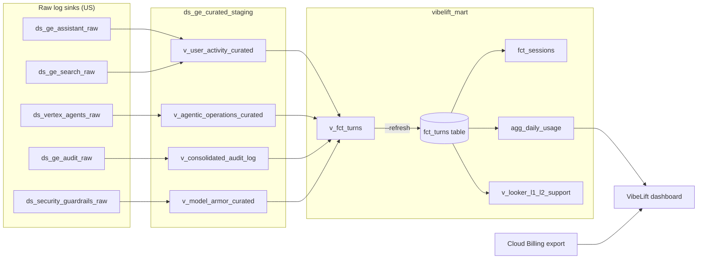

# Gemini Enterprise reporting mart

VibeLift reads Gemini Enterprise (GE) usage from two BigQuery layers built over the GE log sinks.
Everything is a view except `fct_turns`. That table is a materialized copy of the turn logic view
`v_fct_turns`, rebuilt on a schedule. Each row carries `refreshed_at`, so the dashboard can show
how old the data is.



| Layer | Objects | Purpose |
|---|---|---|
| Curated | `v_user_activity_curated`, `v_agentic_operations_curated`, `v_consolidated_audit_log`, `v_model_armor_curated` | Cleaned, typed views over each raw sink. Ported from `gemini-enterprise-stage.ds_ge_curated_staging`, with its defects fixed. |
| Mart | `v_fct_turns` (view), `fct_turns` (table), `fct_sessions`, `agg_daily_usage`, `v_looker_l1_l2_support` (views over the table) | VibeLift's own model: one row per turn, per session, per day × app × agent × model, plus a denormalized L1/L2 support triage view for Looker Studio. |
| Cost | `vibelift/billing_export.py` | Per-day AI spend from the Cloud Billing export, joined to daily usage in the app. It is not stored in BigQuery. |

The stage support mart (`ds_ge_support_analytics`) is not ported. It was built for troubleshooting:
it has no cached or reasoning tokens, no inference model names and no cost.

## Provisioning

```bash
# Preview the SQL / validate it with a BigQuery dry run (no changes)
python3 deploy/bigquery/provision_ge_mart.py --project PROJECT --gcloud-auth --print
python3 deploy/bigquery/provision_ge_mart.py --project PROJECT --gcloud-auth --dry-run

# Create or replace the views and build fct_turns (creates the two datasets in --location if absent)
# Automatically runs verify_ge_mart_invariants.py after provisioning unless --skip-verify is passed.
python3 deploy/bigquery/provision_ge_mart.py --project PROJECT --gcloud-auth --apply

# Rebuild only fct_turns (run this on a schedule) and verify invariants
python3 deploy/bigquery/provision_ge_mart.py --project PROJECT --gcloud-auth --refresh

# Run the 13 mathematical conservation & reconciliation invariants standalone
python3 deploy/bigquery/verify_ge_mart_invariants.py --project PROJECT

# Print only the standalone CREATE OR REPLACE TABLE ... fct_turns DDL for BigQuery Scheduled Queries
python3 deploy/bigquery/provision_ge_mart.py --project PROJECT --print-refresh
```

### Why `fct_turns` is a table

`v_fct_turns` joins four curated views that parse raw JSON log entries. Reading it takes minutes of slot
time even for a few rows. The dashboard reads turns several times per refresh, with a 6-second
REST timeout. Reading a table is fast, and the heavy work runs once per refresh.

Each rebuild covers the whole lookback window, so audit matching stays correct when late log
entries arrive. `CREATE OR REPLACE TABLE` swaps the table atomically, so readers never see a
half-built table.

To schedule the rebuild hourly, run `deploy/setup_mart_refresh.sh`: it creates (or updates) a BigQuery
scheduled query from the `--print-refresh` DDL that runs as the runtime service account. You can also trigger an
on-demand rebuild from the dashboard (**Cost & Billing → Refresh Mart** button, which calls
`POST /api/ge_mart/refresh`). The dashboard reports the last rebuild as `ge_mart_refreshed_at`.

| Flag | Default | Notes |
|---|---|---|
| `--raw-project` | `--project` | Project that holds the raw sink datasets. |
| `--location` | `US` | Must match the raw datasets. BigQuery cannot join across locations. |
| `--curated-dataset` / `--mart-dataset` | `ds_ge_curated_staging` / `vibelift_mart` | Set `VIBELIFT_GE_CURATED_DATASET` / `VIBELIFT_GE_MART_DATASET` to match. Note: if a customer project still relies on legacy `ds_ge_support_analytics.vw_support_master_events`, use `--curated-dataset vibelift_curated` (`VIBELIFT_GE_CURATED_DATASET=vibelift_curated`) so the legacy support views are not broken by schema hardening. |
| `--lookback-days` | 90 | One window for every source (the stage views used different windows). Keep it equal to the raw log retention (`deploy/set_log_retention.sh`, default 90 days). The lookback is fixed in the curated views by `--apply`; `--refresh` and the scheduled query only re-read them. |
| `--audit-lag-seconds` / `--audit-lead-seconds` | 1800 / 30 | Audit-to-activity matching window (see below). |
| `--audit-only` | `errors` | `all` also creates turns from unmatched successful audit calls. |
| `--source key=project.dataset.table` | | Overrides a source table. Keys: `assistant`, `search`, `inference`, `audit_activity`, `audit_data_access`, `armor`. |
| `--skip-verify` | `false` | Skip running `verify_ge_mart_invariants.py` after `--apply` or `--refresh`. |

A missing source table, or one in another location, is replaced with an empty stub. Its views then
return no rows instead of failing. The provisioner reports each source as `FOUND`, `MISSING` or
`WRONG_LOCATION`.

For cost, set `VIBELIFT_BILLING_EXPORT_TABLE` to the detailed billing export table. Without it, cost
fields are `null` and the dashboard shows them as `—`.

## Dashboard Integration Across User Journeys

All four primary user journeys read from `vibelift_mart` and respect the top-bar Gemini Enterprise
scope selector (`#geScopeSelect`):

1. **Overview (Tab 6)**: Reads per-engine turns, sessions, users, and model calls alongside `user_centric` people/cohort summaries.
2. **Agents (Tab 0)**: Streams turn & audit diagnostics (`gemini_enterprise_support_events`) from `vibelift_mart.fct_turns` and filters by `#geScopeSelect`.
3. **Cost & Billing (Tab 3)**: Renders daily turns, chat turns, failed turns, sessions, active users, tokens, and joined Cloud Billing AI net spend (`ai_net_usd`, `usd_per_1k_turns`, `usd_per_1m_tokens`) plus the per-app/agent/model breakdown from `vibelift_mart.agg_daily_usage`, with an on-demand **Refresh Mart** button (`POST /api/ge_mart/refresh`).
4. **Users & Feedback (Tab 4)**: Renders conversation sessions from `vibelift_mart.fct_sessions` (clicking a session pre-fills the CSAT feedback form), top users (`power_users_ldap` with null-safe token/cost display), and recent turn activity (`aive_logs.usage_logs`) from `vibelift_mart.fct_turns`.

## Stage defects fixed in the port

1. Model Armor verdicts arrive as `MODEL_ARMOR_SANITIZATION_VERDICT_BLOCK`. Stage compared them with
   `BLOCK`, so no block was ever detected. The prefix is now stripped.
2. `answer_state` is `SUCCEEDED` in the sink. Stage expected `COMPLETED`, so every chat was marked failed.
3. The stage `tbl_*` snapshot tables had gone stale. Everything here is a view.
4. Invented defaults removed: `ANONYMOUS_USER`, `Core Assistant`, `STANDALONE_SESSION`, 0 documents.
   Unknown stays NULL.
5. Searches no longer count as sessions. `session_id` comes from the answer resource name
   (`…/sessions/<id>/assistAnswers/<id>`).
6. The Model Armor `trace` is null. Armor joins on the assist token, then falls back to trace.
7. Token fan-out: stage `FULL OUTER JOIN`ed inference to activity on trace, which copied the same
   tokens onto every row in the trace. Tokens are now aggregated per trace and attached to one turn
   (`trace_rank = 1`). Model name, cached tokens and reasoning tokens were added.
8. One lookback window for all sources.
9. Targeted JSON paths replace regexes over the whole serialized payload.
10. No caller IPs, prompt or response text, or file names. Only sizes, counts and MIME types are kept.
11. No hard-coded project IDs.
12. JSON paths use the sink's lowercase names (`logmetadata.methodname`). The camelCase paths were
    always NULL.
13. Audit status codes are `google.rpc.Code` values, not HTTP codes (8 = `RATE_LIMITED`).
14. Tool diagnostics read only the last input message, not the whole conversation history.
15. Cloud Audit Logs writes two `DATA_ACCESS` rows (`operation.first=true` and `operation.last=true`
    with the same `operation.id` at the same timestamp) for every streaming RPC (`StreamAssist`).
    `v_consolidated_audit_log` deduplicates by `operation.id` so each call is counted once.
16. Some GE apps write `"<elided>"` in `jsonPayload.useriamprincipal` in the activity sink while
    still logging the real `principalEmail` in Cloud Audit Logs. Non-email values become `NULL` in
    `v_user_activity_curated`, and `v_fct_turns` falls back to engine + method + time matching
    (`ENGINE_TIME`) so `COALESCE(user_email, audit_principal_email)` recovers the real principal.
17. Cloud Logging → BigQuery sinks deliver with at-least-once semantics and occasionally write
    duplicate rows with the same `insertId` (observed in `gemini-enterprise-stage.ds_ge_search_raw`).
    All four curated views (`v_user_activity_curated`, `v_agentic_operations_curated`,
    `v_model_armor_curated`, and `v_consolidated_audit_log`) deduplicate by `insertId` so every
    `turn_id` in `fct_turns` is strictly unique.
18. Reasoning tokens in `discoveryengine_googleapis_com_gen_ai_client_inference_operation_details`
    arrive under `jsonPayload.gen_ai_usage_reasoning_output_tokens` (55,779 tokens across 56 calls
    in `gemini-enterprise-stage`). `v_agentic_operations_curated` checks
    `gen_ai_usage_reasoning_output_tokens`, `gen_ai_usage_reasoning_tokens`, and
    `gen_ai_usage_thoughts_tokens` across both sink `RECORD` columns and dotted JSON keys.
19. When an MCP tool response exceeds ~25 KB, Gemini Enterprise elides `structuredContent` from a
    JSON object (`RECORD`) to a string (`"...[STRUCTURED_CONTENT_ELIDED...]"`), causing BigQuery's
    sink schema validation to reject that call and every subsequent call in the conversation into
    `<dataset>.export_errors` (`logEntry`). `provision_ge_mart.py` automatically unions
    `export_errors` when present, and `v_agentic_operations_curated` reads both normalized
    underscore keys (`gen_ai_usage_input_tokens`) and original dotted keys
    (`"gen_ai.usage.input_tokens"`).
20. When an agent attempts to call an undeclared tool, Gemini Enterprise rewrites the tool call
    `part.name` to `invalid_tool_call_notifier` and records the attempted tool name in
    `part.arguments.tool_name`. `v_agentic_operations_curated` extracts `part.arguments.tool_name`
    so `tool_names` reflects the actual tool attempted.
21. Model Armor's top-level execution status in `modelarmor_googleapis_com_sanitize_operations` is
    `sanitizationresult.invocationresult` (`"SUCCESS"`), whereas `executionstate` appears in
    activity guardrail audits. `v_model_armor_curated` coalesces both.
22. `UploadSessionFile` image/file Model Armor checks (`STARTS_WITH(sanitized_text, 'Sanitized file content')`)
    emit a one-off correlation UUID instead of an `NMwK`/`M8gK` `assist_token`. `v_fct_turns` pairs each
    unmatched file-upload Model Armor check 1:1 with the closest completed `UploadSessionFile` turn within ±10s,
    recovering file-upload Model Armor findings (such as image scan errors) onto the corresponding file-upload turn.

## Audit matching

GE writes the audit entry when a request starts and the activity entry when it finishes. For a
long agent reply the gap can exceed two minutes (171 s was observed on stage). `fct_turns` matches
1:1 in two mutual-best rounds:

- Tier 0 (`TRACE`): by trace when both sides have one.
- Tier 1 (`PRINCIPAL_TIME`): by principal, engine and method, with the audit entry up to
  `audit_lag` before or `audit_lead` after the activity entry.
- Tier 2 (`ENGINE_TIME`): when the activity sink elided `user_email`, by engine and method within
  the same window.

Unmatched audit calls become `AUDIT_ONLY` turns only when they failed. Those failures (quota,
permission, agent errors) may exist only in the audit log.

Validation results (example runs in two reference projects; your numbers will differ):

| Check | `gemini-enterprise-stage` (90d) | `project-maui` (30d) |
|---|---|---|
| Chats matched to audit | 9 of 9 | 11 of 11 (4 `PRINCIPAL_TIME`, 7 `ENGINE_TIME`) |
| Searches matched to audit | 33 of 41 | 10 of 10 (4 `PRINCIPAL_TIME`, 6 `ENGINE_TIME`) |
| Elided / NULL `user_email` after join | 0 | 0 (all 13 `<elided>` rows recovered from audit) |
| `AUDIT_ONLY` turns | 0 | 9 errors (1 failed `StreamAssist` on an engine without activity logs, 8 `ExecuteUiWidgetAction` deadline-expired) |
| Inference tokens | 38,520 in both source and `fct_turns` (no fan-out) | `NULL` (no inference sink in US) |
| Guardrail block | Detected (`SENSITIVE_DATA`, `GE_GUARDRAIL_BLOCK`) | `NULL` (no Model Armor sink in US) |
| Sessions | 7 real sessions for 9 chat turns | 8 real sessions for 11 chat turns |

## Known gaps

- **Tokens need the inference sink.** Per-turn tokens come only from the
  `discoveryengine.googleapis.com/gen_ai.client.inference.operation.details` log, routed to
  `ds_vertex_agents_raw` by the `sink-ge-inference-tokens` sink in `deploy/setup_bigquery_sink.sh`.
  Projects set up before that sink existed (project-maui at the time of the table above) have
  sessions but `NULL` tokens until the sink is created; sinks only capture new entries.
- Model Armor rows need the `sink-model-armor-sdp` sink and Model Armor logging enabled (`ds_security_guardrails_raw.cloud_logging_guardrails`). When absent, the provisioner substitutes an empty typed stub automatically.
- `sre_triage_agent_telemetry` is in `us-east1` and cannot be joined from the US views. VibeLift
  still reads it separately.
- Cost is project-level AI spend (every AI service in the project). The billing export has no
  per-agent or per-user split, so cost is never allocated below project × day.
- `fct_turns` is rebuilt in full over the lookback window. At much larger volumes, switch to an
  incremental `MERGE` over recent partitions.

## Automated Conservation & Reconciliation Invariants

Every `provision_ge_mart.py --apply` and `--refresh` automatically runs `deploy/bigquery/verify_ge_mart_invariants.py`, which asserts 13 mathematical zero-loss invariants across the curated views and mart objects:

1. `fct_turns_unique_turn_id`: `COUNT(1) == COUNT(DISTINCT turn_id)` in `fct_turns` (no duplicate turn rows from at-least-once sink deliveries).
2. `looker_support_view_no_fanout`: `COUNT(1) == COUNT(DISTINCT turn_id) == COUNT(fct_turns)` and `SUM(total_tokens) == SUM(fct_turns.total_tokens)` in `v_looker_l1_l2_support` (pre-aggregated tool calls, errors, citations, and Model Armor checks never cause 1:N row fan-out in Looker Studio).
3. `fct_sessions_unique_session_id`: `COUNT(1) == COUNT(DISTINCT session_id)` in `fct_sessions` (no duplicate session rows across engine keys).
4. `session_turn_conservation`: `SUM(fct_sessions.turns) + COUNTIF(fct_turns.session_id IS NULL) == COUNT(fct_turns)`.
5. `session_token_conservation`: `SUM(fct_sessions.total_tokens) + SUM(IF(session_id IS NULL, total_tokens, 0)) == SUM(fct_turns.total_tokens)`.
6. `daily_agg_turn_conservation`: `SUM(agg_daily_usage.interactions) == COUNT(fct_turns)`.
7. `daily_agg_token_conservation`: `SUM(agg_daily_usage.total_tokens) == SUM(fct_turns.total_tokens)`.
8. `inference_token_conservation`: `SUM(v_agentic_operations_curated.total_tokens)` (within lookback) `== SUM(fct_turns.total_tokens)` (0 dropped or fanned-out tokens).
9. `tool_failure_bounds`: `0 <= tool_failure_count <= tool_call_count` per trace and per turn.
10. `file_upload_session_coverage`: `UploadSessionFile` rows in `v_user_activity_curated` have non-null `session_id` and `has_uploaded_file = TRUE`.
11. `armor_inspect_only_exclusion`: `v_model_armor_curated` never marks inspect-only (`enforcement type is inspect only` / `not blocked`) or `SANITIZATION_EXECUTION_SKIPPED` rows as `is_blocked = TRUE`.
12. `audit_session_extraction_coverage`: `v_consolidated_audit_log` extracts `session_id` whenever `sessions/<id>` is present in `resource_name` or request/response JSON.
13. `materialized_fct_turns_sync`: `fct_turns` row count and total tokens match live `v_fct_turns`.

See [`docs/LOOKER_STUDIO_GUIDE.md`](./LOOKER_STUDIO_GUIDE.md) for the complete 4-page Looker Studio L1/L2 IT Support Dashboard specification, 1-click creation links, operational safeguards, and zero-fan-out latency architecture.
